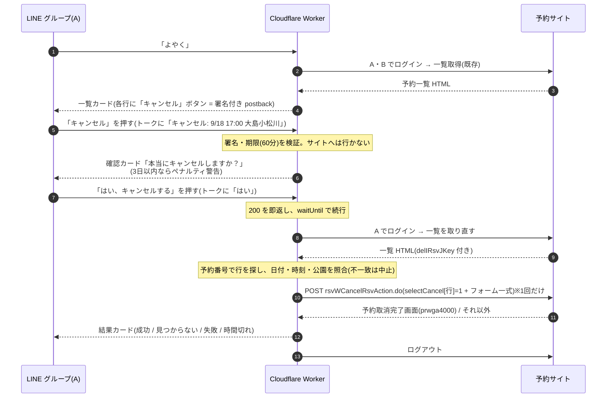

# 予約空き監視・LINE通知システム 要件定義書

作成日: 2026-08-31 / 最終更新: 2026-09-02(フェーズ1.5 予約確認ボットの実装完了を反映)

**ステータス: フェーズ1は2026-09-01より本稼働中**(3分おきチェック・グループLINE通知)
**フェーズ1.5(予約確認ボット)は2026-09-02より稼働中**(§11)

## 1. 目的

特定の予約サイトの空き状況を定期的に自動チェックし、新しく空きが出たときだけ自分のLINEに通知を受け取る。

## 対象サイト(確定)

- 東京都スポーツ施設予約システム
- URL: https://kouen.sports.metro.tokyo.lg.jp/web/index.jsp
  - ※2023年のリニューアルでURLはそのまま中身だけ新システム化されており、このURLが現行の入口(2026-08-31 実機確認済み)。yoyaku.sports系URLは別システムのため使わない
- ログイン: 空き状況の照会だけなら不要(実機確認済み)。フェーズ1ではログイン処理・認証情報の保管は行わない。ログインが必要になるのは予約を実行するフェーズ2から
- 特記事項:
  - 週表示カレンダーは内部のJSON APIから描画されているため、**ブラウザ自動化(Playwright)は不要**で、素のHTTP(Node標準fetch+Cookie持ち回り)でAPIを直接叩ける(当初想定から方式変更。§3参照)
  - レスポンスの文字コードはShift_JIS(Windows-31J)
  - サーバはやや不安定(一時的な502、セッション未認識のまま200が返るパターンあり)なため、公園単位で新セッションからのリトライ(最大3回)を実装済み
  - 夜間・定期メンテナンス時間帯はチェックをスキップする設計

## 監視対象(確定)

- 種目: テニス(人工芝) — サイト内部コード `1000_1030`
- 休日の定義: 日本の土日祝(祝日判定には japanese-holidays を使用)

| 区分 | 施設 | 公園コード | 時間帯 |
|---|---|---|---|
| 平日 | 猿江恩賜公園 | 1040 | 19時の枠のみ |
| 土日祝 | 猿江恩賜公園 | 1040 | 全ての時間 |
| 土日祝 | 亀戸中央公園 | 1050 | 全ての時間 |
| 土日祝 | 大島小松川公園 | 1160 | 全ての時間 |

- 公園コードは現行システムの調査結果(旧システムの05/06/24は廃止)。定義は `lib/config.js` に一元化
- 時間帯は9〜21時の2時間枠×6本(9/11/13/15/17/19時開始)。平日監視対象の19:00-21:00枠は存在する

### 「空き」の判定方法(確定)

内部APIが返す週単位の空き状況JSONから、対象枠の空き面数が1以上のものを「空きあり」と判定する(画面上の🟣記号に相当)。詳細な調査記録は `docs/site-notes.md` 参照。

### 通知の形式(確定)

- カード型のFlex Messageで通知(日付チップ: 土=青/日祝=赤/平日=グレー、残1面はオレンジ強調、予約サイトへのリンクボタン付き)
- 施設名・日付・時間帯・空き枠数を含める。1通に最大12件表示、超過分は「…ほかN件」(LINEのFlex 10KB制限対策)
- 通知先はユーザーID(`U`〜)またはグループID(`C`〜)。現運用はグループ宛て(A・B・ボットのグループ)

## 2. 方針(決定済み)

- AI(Claude)に毎回チェックさせる方式は、高頻度実行だと月1.5万〜6万円程度かかるため不採用。
- GitHub Actions + Node.js による構成を採用。ランニングコストはほぼ0円。
- 当初はPlaywright(ブラウザ自動化)を想定していたが、内部JSON APIを直接叩ける事が判明したため**HTTP直叩き方式に変更**(実装済み)。依存はjapanese-holidaysの1個のみ、1回の実行は約1.5〜2分
- スコープはフェーズ1(通知のみ)。LINEのボタンから予約まで行うフェーズ2は将来対応とする。

## 3. システム構成(フェーズ1)

| 部品 | 役割 | サービス | 費用 |
|---|---|---|---|
| 定期起動 | 3分おきにworkflow_dispatch APIを叩いてActionsを起動 | cron-job.org(無料) | 無料 |
| 実行環境 | 起動されたworkflowで空きチェックスクリプトを実行 | GitHub Actions | 無料枠内 |
| 空きチェック | 内部JSON APIをHTTPで直接叩いて空きを判定 | Node.js(標準fetch) | 無料 |
| 状態保存 | 前回結果をstate.jsonに保存し、変化した時だけ通知(重複通知防止) | リポジトリ内ファイル | 無料 |
| 通知 | 空き検知時に自分のLINEへpush通知 | LINE Messaging API | 無料枠(月200通)内 |

処理フロー:
cron-job.org(3分おき)→ workflow_dispatch APIでGitHub Actionsを起動 → Node.jsが内部APIで空き取得(公園ごとにセッション取得→検索条件POST→週JSON取得を5週分)→ 監視条件で絞り込み → 前回結果と比較 → 新しい空きがあればLINE Messaging APIでpush → グループLINEに通知が届く

APIフロー詳細:
1. `GET /web/index.jsp` でセッションCookie取得
2. `POST /web/rsvWOpeInstSrchVacantAction.do` で検索条件をセッションに載せる(公園ごと)
3. `POST /web/rsvWOpeInstSrchVacantAjaxAction.do` で1週間分の空きがJSONで返る(useDayを+7日しながら5週分)

## 4. 監視仕様(確定)

- **監視範囲**: 当日から1ヶ月分(週送りで5週分取得)
- **稼働時間**: 24時間監視。ただしサイト側の定期メンテナンス中(毎月27日12:00〜28日8:45、年末年始12/28 12:00〜1/4 8:45)はエラーではなく「スキップ」として静かに扱う(lib/maintenance.js)。深夜のLINE通知はスマホのおやすみモード等で対処し、システム側では制御しない
- **リポジトリ**: public(決定)。publicリポジトリはGitHub Actionsの実行時間が無料・無制限。コードと監視条件は公開されるが、トークン等はSecretsのため公開されない
- **チェック間隔**: **3分おき**(実効遅延は平均約3.5分。サイトアクセスは約9,100回/日)
- **定期起動の方式**: **cron-job.org(無料)からのworkflow_dispatch API呼び出し**(2026-09-01変更)
  - 当初のGitHub Actionsの`schedule`(cron)は、アカウントレベルで極端に間引かれる問題が発生
    (5分指定で実効3〜4時間。構文・UTC・権限等の仮説は全て検証済みで白。検証用リポジトリ
    `y-ykym/cron-canary` でも同一症状を確認)したため不採用に変更
  - monitor.ymlから`schedule`トリガーは削除済み(GitHub cron正常化時の二重実行防止)
  - 認証はfine-grained PAT(対象リポジトリのみ・Actions: Read/Write・**期限1年**)。cron-job.orgの失敗時メール通知ON
  - `cron-canary`でGitHub cronの正常化を観測中。正常化したら`schedule`に戻しcron-job.orgを停止する(手順はREADME運用メモ)
  - 同時実行の重複を防ぐため、workflowに concurrency 設定を入れて前の実行が終わってから次を動かす
- **利用規約**: 確認済み。自動アクセスに関する問題なし
- **運用上の注意**:
  - state.jsonの保存はpush競合(実行中に人間がpushした場合)に備え `git pull --rebase -X theirs`+リトライ3回で確実に行う(失敗すると同じ空きを二重通知するため)
  - 「60日活動なしでscheduled workflow自動停止」ルールは、外部トリガー化により当面は無関係。GitHub cronの`schedule`に戻した際は再び適用される(state.jsonの自動コミットで通常は維持)
  - **1年後にfine-grained PATの期限が切れる**ので、cron-job.org側の再設定が必要(2027-09頃)

## 5. 事前準備(ユーザー側の作業) — 完了済み

1. ~~GitHubアカウントを用意し、publicリポジトリを1つ作成~~ ✅
2. ~~LINE Developersで無料のMessaging APIチャネル(公式アカウント)を作成~~ ✅
3. ~~チャネルアクセストークンと自分のユーザーIDを取得~~ ✅
4. ~~上記2つをGitHubリポジトリのSecretsに登録(LINE_CHANNEL_ACCESS_TOKEN / LINE_USER_ID)~~ ✅

## 6. 成果物(フェーズ1)

- `check.js` — メイン処理(取得→絞込→差分→通知→保存)
- `lib/scrape.js` — 内部APIからの空き取得(リトライ込み)
- `lib/config.js` — 公園定義・監視条件の一元管理(公園の増減はここだけ編集)
- `lib/filter.js` / `lib/state.js` / `lib/notify.js` / `lib/date.js` / `lib/maintenance.js` — 絞込・差分・LINE通知(Flex Message)・JST日付処理・メンテ判定
- `.github/workflows/monitor.yml` — 定期実行のGitHub Actions設定
- `state.json` — 前回の空き状況(自動更新)
- `README.md` — セットアップ手順書
- `docs/site-notes.md` — サイト調査記録(API仕様・コード表)

## 7. 注意点・制約

- GitHub Actionsのcronは混雑時に数分〜十数分遅れることがある。分単位の即時性が必要なら格安VPS(月500円程度)に移行する。
- 内部APIは非公開仕様のため、サイト改修でJSON形式やエンドポイントが変わるとlib/scrape.jsの修正が必要になる(Actionsの失敗ログで検知)。
- サーバ側の一時的な502等はリトライ(最大3回)で吸収。それでも失敗した回は「スキップ」扱い。

## 8. フェーズ2(将来対応): LINEのボタンから予約実行

通知のFlexカードに「予約する」ボタンを追加し、タップで該当枠を自動予約する(通知のFlex化自体はフェーズ1で実施済み)。

追加構成: LINEボタン → Cloudflare Workers(Webhook受け口・無料)→ GitHubの repository_dispatch でActionsを起動 → 予約処理を実行 → 結果をLINEに返信。

Workersを挟む理由: LINEのWebhookは送信先のヘッダーや形式をカスタマイズできず、GitHub APIを直接呼べないため、署名検証と形式変換を行う「通訳」が必要。

フェーズ2の注意点:
- 早い者勝ち問題: 予約実行直前に再度空きを確認し、埋まっていたら失敗を通知する。
- 決済の自動化は非推奨。予約確定直前で止めてURLを送るか、現地払いのサイトに限定する。
- 自動予約はサイトによって規約違反となる場合があるため事前確認が必須。

## 9. コストまとめ

- フェーズ1・2ともランニングコスト: ほぼ0円(cron-job.org含め全サービス無料枠内)
- LINE通知: 月200通まで無料(グループ宛ても1通カウント。消費ペースは見守り中)

## 10. 見守り事項(運用中)

1. `cron-canary` の間隔正常化 → 確認できたらGitHub cronの`schedule`へ戻しcron-job.orgを停止
2. LINE月200通の消費ペース
3. fine-grained PATの期限(2027-09頃に再発行・再設定)
4. (フェーズ1.5)A・Bがサイトのパスワードを変えたら Workers Secrets(`SITE_PASS_A` / `SITE_PASS_B`)を更新
5. (フェーズ1.5)利用者カードの有効期限。切れるとボットのログインが失敗し「取得失敗」になる(期限更新は2週間前からマイメニューで可能)
6. (フェーズ1.5)予約サイトが reCAPTCHA を有効化したら自動ログイン不可 → 方式の見直し

## 11. フェーズ1.5: LINEグループでの予約確認ボット

**ステータス: 実装済み・2026-09-02 稼働開始**(A・B 2人分で動作確認済み。返信まで実測6〜12秒)

実装時に確定・変更した点(以下の各節の記述より本項が優先):

- **返信は Flex Message(カード)** に変更(11.2 の「Flex不使用」から変更。利用者の要望)。全員0件・全員失敗のときだけ 11.2 のテキスト文言。片方失敗はその人の区画に「取得失敗」、片方0件は「予約なし」
- **200 は即時に返し、取得・返信は Cloudflare の `waitUntil` で応答後に続ける**。LINE は Webhook の応答を長く待たず、処理してから200を返す方式では接続を切られて Worker が打ち切られた(実測)。`waitUntil` は応答後最長30秒のため、取得は25秒で打ち切り、再試行は開始10秒以内の失敗のみ、予約サイトからのログアウトは返信後に回す
- **1分超過時の push フォールバック(11.4・11.9の4・11.12の5)は未実装**。実測で必要になったら追加する(200通枠を消費するため)
- 11.9 の確認結果: 利用規約に自動ログインを禁じる記述なし(利用者確認済み)。B本人の同意あり。**ログイン時に CAPTCHA・SMS/MFA の追加画面は出ない**(reCAPTCHA の仕組みは組み込まれているが無効化されている。有効化されたら検知してエラーにする)。Cloudflare からのアクセスは問題なく通る
- 認証エラー(パスワード誤り・カード期限切れ)は**再試行しない**(アカウントロック防止)
- 11.11 の `lib/` 共通化は行わず、`worker/src/site.js` に考え方だけを写した(lib/scrape.js は Node 専用の fs・CommonJS に依存しており、稼働中コードを触らないため)
- 予約サイトの調査結果(ログインAPI・予約一覧HTMLの構造)は `docs/site-notes.md`「フェーズ1.5 追加調査」、運用手順は README「フェーズ1.5 予約確認ボット」に記載

### 11.1 目的

グループトークで「よやく」と送るだけで、A・B両名が予約サイト上に持っている**確定済み予約**を一覧で返す。「自分いつ取ってたっけ」「相手はいつ入れてる?」をサイトにログインせず確認できるようにする。

### 11.2 使い方(利用者から見た仕様)

- グループで `よやく` と送信 → ボットが即返信
- コマンドはこの1つのみ。出し分け・引数なし。常に全員分を返す
- 返信例

```
📅 予約一覧(9/2 現在)
・A  9/6(土)  9:00-11:00 猿江恩賜公園
・A  9/13(土) 11:00-13:00 亀戸中央公園
・B  9/10(水) 19:00-21:00 猿江恩賜公園
```

- 予約が1件もない場合: `予約はありません`
- 取得に失敗した場合: `予約サイトに繋がりませんでした。少し待ってもう一度お試しください`
- 返信は通常のテキストメッセージ(Flex不使用。件数が少なく読みやすさ優先)

### 11.3 キーワード判定

- テキストメッセージのみ対象。前後の空白・改行を除いた上で `よやく` と**完全一致**した時だけ反応
- 「予約しといたよ」「よやくした」などには反応しない
- ひらがな3文字なのでスマホのフリック入力だけで完結(変換・スペース不要)
- 送信元が**設定済みのグループID**(現在の通知先グループ)と一致しない場合は無視(他のグループに招待されても動かない)

### 11.4 前提・LINE側の制約(公式仕様)

- グループトークにはリッチメニューを設置できない → キーワード応答方式で実現
- 応答(reply)メッセージは**無料枠の月200通にカウントされない**。この機能でLINEの通数は消費しない
- replyトークンは**受信から1分以内**に使う必要がある → 1分以内に予約サイトから取得して返す設計が必須(超過時のみpush=200通枠を消費、11.9参照)
- 公式アカウントの設定変更が必要(11.8のチェックリスト)

### 11.5 システム構成

```
LINEグループ「よやく」
  → LINE Platform が Webhook を送信
  → Cloudflare Workers(無料)
      1. 署名検証(X-Line-Signature を channel secret で検証)
      2. グループID・「よやく」完全一致を判定。違えば何もしない
      3. 予約サイトへ A と B それぞれでログイン(並行)
      4. 予約確認画面(一覧)を取得・Shift_JISをデコード・整形
      5. replyトークンで返信
  → グループに一覧が届く
```

| 部品 | 役割 | サービス | 費用 |
|---|---|---|---|
| Webhook受け口・処理本体 | 署名検証、判定、サイト照会、返信 | Cloudflare Workers(無料プラン: 10万リクエスト/日) | 無料 |
| 秘密情報 | 利用者番号・パスワード・LINEトークン等 | Cloudflare Workers Secrets | 無料 |
| 返信 | reply API | LINE Messaging API | 無料(200通枠の対象外) |

**GitHub Actionsを使わない理由**: Workflow起動は待ち時間が30秒〜数分あり、replyトークンの1分制限に間に合わない。Actions経由にするとpush送信(200通枠を消費)になってしまう。Workersなら数秒で応答できる。

**フェーズ2との関係**: フェーズ2の構成図(§8)にある「Cloudflare Workers(Webhook受け口)」と同じ部品。今回作る署名検証・LINE設定・Workersの配置がそのままフェーズ2の土台になる。フェーズ2ではこのWorkerに「ボタン押下(postback)→ repository_dispatch」の分岐を足すだけ。

**データベースを持たない理由**: 毎回サイトから取れば常に最新(キャンセル・抽選当選の確定も反映)で、登録・同期の手間がゼロ。呼ばれる頻度は1日数回以下の想定なのでサイトへの負荷も無視できる。

### 11.6 予約データの取得方法

- ログイン方式: **利用者番号 + パスワード**(公式案内より。SMS認証は利用者登録時のみ)
  - ※ログイン時にCAPTCHAやSMS認証が毎回入るかは**実機で要確認**(11.9)
- 取得対象: ログイン後の「予約確認」画面(予約一覧)。抽選当選を確定したものも通常予約と同じ一覧に載る想定
- 予約確認画面の内部API(URL・パラメータ・JSON形式)は**未調査**。フェーズ1と同じ手順(Chrome DevToolsのNetworkタブ)で調べ、結果は `docs/site-notes.md` に追記する
- 文字コードはShift_JIS(現行と同じ。`TextDecoder('shift_jis')`)
- サイトが不安定(502・セッション未認識)な既知の問題への対策は現行と同じ: 新セッションからリトライ最大2回(1分制限があるため回数は少なめ)
- 表示名: 設定値 `LABEL_A` / `LABEL_B`(例: A / B や名前)。LINEのuserIdは使わない

### 11.7 秘密情報(Cloudflare Workers Secrets)

| 名前 | 内容 |
|---|---|
| `LINE_CHANNEL_SECRET` | Webhook署名検証用(LINE Developersコンソールで取得) |
| `LINE_CHANNEL_ACCESS_TOKEN` | reply送信用(現行のGitHub Secretsと同じ値) |
| `LINE_GROUP_ID` | 反応するグループID(現行の `LINE_USER_ID` と同じ値) |
| `SITE_USER_A` / `SITE_PASS_A` | Aの利用者番号・パスワード |
| `SITE_USER_B` / `SITE_PASS_B` | Bの利用者番号・パスワード |
| `LABEL_A` / `LABEL_B` | 返信に表示する名前 |

パスワードはコード・リポジトリに一切書かない。`wrangler secret put` で登録する。Bの認証情報はB本人が同意した上で預かる(11.9)。

### 11.8 LINE公式アカウント側の設定チェックリスト

LINE Developersコンソール(Messaging API設定)

- [ ] Webhook URL に WorkersのURL(`https://xxx.workers.dev/webhook`)を設定
- [ ] 「Webhookの利用」を **ON**
- [ ] 「グループトーク・複数人トークへの参加を許可する」を **ON**(デフォルトOFF。既にグループに入って通知できているなら済んでいる可能性が高いので確認のみ)
- [ ] 「検証」ボタンで疎通確認(Workersが200を返せばOK)

LINE Official Account Manager(応答設定)

- [ ] 「応答メッセージ」を **OFF**(ONのままだと「よやく」以外の全発言に定型文が返ってしまう)
- [ ] 「あいさつメッセージ」は任意(OFF推奨)
- [ ] 「Webhook」を **ON**

### 11.9 リスク・要確認事項

1. **利用規約**: フェーズ1(ログイン不要の照会)と違い、本人アカウントで**自動ログイン**する。フェーズ2と同じ論点なので、規約・利用案内に自動ログインを禁じる記述がないか着手前に確認する
2. **B の認証情報を預かること**: 利用案内に「利用カードを第三者へ貸し出すと登録抹消」の規定がある。今回は本人の予約を本人のために照会するだけだが、Bの利用者番号・パスワードをYu管理のCloudflareに置く点はB本人の同意を必ず取る。不安があれば「Bの分は手入力登録方式」に切り替える(11.10)
3. **ログインに毎回CAPTCHA/SMSがある場合**: 自動ログイン不可。この場合は方式を「LINEから手入力で登録(例: `とうろく 9/10 19時 猿江`)」に変更する。着手の最初にこれを実機確認する
4. **1分制限**: ログイン+取得が1分を超えるとreplyできない。対策として(a) A・Bを並行取得、(b) 超過時のみpushで送る(200通枠を消費)。通常は数秒で終わる想定
5. **WorkersのアクセスIP**: Cloudflareのデータセンター経由でのアクセス。現行のGitHub Actions(海外IP)で問題ないため通る見込みだが、疎通は最初に確認する
6. **パスワード変更・カード期限**: 本人がサイトのパスワードを変えたらSecretsも更新が必要。利用者カード期限切れでログイン不可になる → 失敗メッセージで気づける
7. **なりすまし・誤爆**: 署名検証+グループID一致で防ぐ。1対1トークで「よやく」と送られても反応しない

### 11.10 やらないこと(スコープ外)

- リッチメニュー・常設ボタン(グループでは仕様上不可)
- クイックリプライ・Flexのボタン(確認だけなら不要。フェーズ2の「予約する」「キャンセル」で検討)
- ユーザーごと・名前指定の出し分け
- 予約データのDB保存・手入力登録(11.9の3・2に該当した場合のみ代替として採用)
- サイト側の予約変更・キャンセル操作(※キャンセルは §12 で追加。予約変更は引き続きスコープ外)

### 11.11 成果物

- `worker/src/index.js` — Webhook受け口(署名検証・判定・サイト照会・返信)
- `worker/wrangler.toml` — Workers設定(Secretsは含めない)
- `lib/` の共通化: Shift_JISデコード・セッション取得の処理を `worker/` からも使えるよう切り出す(可能な範囲で)
- `docs/site-notes.md` 追記 — ログインAPI・予約確認APIの調査結果
- `README.md` 追記 — Workersの配置手順、LINE設定チェックリスト、Secrets一覧

### 11.12 実装の進め方(順番)

1. LINE設定変更(11.8)と、Cloudflareアカウント作成(無料)
2. 「よやく」に固定文言を返すだけの最小Workerを配置し、グループで疎通確認(ここまでで LINE側の疑問は全て解消)
3. 実機で予約サイトのログイン・予約確認画面をDevToolsで調査 → CAPTCHA/SMSの有無をここで判定(11.9の3)。site-notes.mdに記録
4. Workerにログイン・取得・整形を実装。まずAの分だけで動作確認 → Bを追加
5. エラー時メッセージ・1分超過時のpushフォールバックを入れて本稼働

### 11.13 コスト

ランニングコスト 0円(Cloudflare Workers無料プラン・LINE reply無料)。既存の月200通枠も消費しない(1分超過時のpushのみ例外)。

## 12. フェーズ1.6: LINEからの予約キャンセル

**ステータス: 実装済み・配置済み(2026-09-06)。使い捨て予約(9/18 亀戸中央)で一覧 → 確認 → 取消成功まで実機確認済み**

実装時に確定した点(以下の各節の記述より本項が優先):

- postback data は `c|A|予約番号|YYYYMMDD|HHMM|HHMM|公園名|penaltyday|期限.署名` の約 80 文字(`worker/src/cancel-token.js`)。
  終了時刻も入れて確認カードに「17:00 - 19:00」を出す。公園名はコードではなくサイト表記をそのまま入れる(照合に使う)
- 「いいえ」の postback data は署名無しの `n`(サイトへ行かず文言を返すだけなので検証不要)
- 署名不正の postback は返信せず無視(ログのみ)。期限切れは「時間切れです」を返す。`CANCEL_ENABLED` が "1" 以外のときに
  古いカードのボタンが押されたら「キャンセル機能は現在停止しています」を返す
- 取消 POST 後の応答が完了画面でない(`failed`)と、POST 自体が失敗(`unknown`)はどちらも「キャンセルできませんでした」カード。
  一覧に無い(`not_found`)・内容不一致(`mismatch`)はテキストで返す
- 一覧カードの行数は固定値ではなく 9,800 バイトに収まるまで減らす(実測: ボタン付き 7 行 ≒ 9.0KB)
- 配置手順・実機テスト手順・トラブル時の見方は README「フェーズ1.6 予約キャンセル」

事前調査(`docs/site-notes.md`「キャンセル機能の事前調査」)で確定した前提:

- 予約サイトの取消導線(一覧画面 → 「キャンセル」→ 完了画面)に **reCAPTCHA は無い**。取消は一覧画面のフォーム一式に `selectCancel[行]=1` を付けて `POST rsvWCancelRsvAction.do` する **1回の POST で即時確定**し、確認画面は挟まらない
- 応答が予約取消完了画面(`prwga4000.jsp`)なら成功。取消後の一覧から該当行は消える
- したがって **フェーズ1.5 の Worker(HTTP 直叩き)に足すだけで実現できる**。ブラウザ・Raspberry Pi は不要

### 12.1 目的

「よやく」で出た予約一覧から、サイトにログインせずに予約を取り消せるようにする。誤操作で取り消せない操作をしてしまわないよう、**必ず 2 段階の確認**を挟む。

### 12.2 使い方(利用者から見た仕様)

1. グループで `よやく` → 予約一覧カード(既存)。**各予約の行に「キャンセル」ボタン**が付く(終了済みの枠には付けない)
2. 「キャンセル」を押す → ボットが確認カードを返信
   ```
   本当にキャンセルしますか？
   A  9/18(金) 17:00-19:00 大島小松川公園
   [ はい、キャンセルする ]  [ いいえ ]
   ```
   - 利用日が近い(12.5)場合は先頭に **「⚠ 利用日が3日以内のためペナルティ(1点)が付きます」** を出す
3. 「はい、キャンセルする」を押す → ボットが予約サイトで取消を実行し、結果を返信
   - 成功: `キャンセルしました  A 9/18(金) 17:00-19:00 大島小松川公園`(直後に `よやく` で一覧から消えていることを確認できる)
   - 一覧に見つからない: `この予約は見つかりませんでした(既にキャンセル済みの可能性があります)。「よやく」で確認してください`
   - 失敗(サイト不調・想定外画面): `キャンセルできませんでした。予約サイトで状態を確認してください`(**取消されたか不明なときも同じ文言**で、必ず確認を促す)
   - 期限切れ(12.4): `時間切れです。「よやく」からやり直してください`
4. 「いいえ」を押す → `キャンセルしませんでした`

- ボタン押下は LINE の postback で送り、**押した内容はトークにも表示する**(`displayText`。例:「キャンセル: 9/18 17:00 大島小松川」「はい」)。誰がいつ押したかがグループに残る
- 誰の予約でも、グループのメンバーなら取り消せる(2人グループで相互了解済みの前提。制限したくなったら LINE userId と A/B の対応を Secrets に持たせて絞る)

### 12.3 構成図と処理の流れ

構成図: `docs/system-overview-cancel.html`(画像版 `docs/system-overview-cancel.png`)。登場するのは **LINE グループ・Cloudflare Worker・予約サイトの 3 つだけ**で、既存の「よやく」ボットに postback の分岐を足す。



- 取消の POST は **絶対に再試行しない**(成否不明のまま2回送らない)。再試行はログイン・一覧取得(POST 前)に限り、開始10秒以内のみ(既存と同じ)
- 一覧の行 index は表示のたびに変わり得るため、**postback の data に index は入れない**。予約番号(+日付・時刻・公園)で毎回探し直す
- `delIRsvJKey` は一覧を取得したセッションのものをそのまま送る(ログイン〜取消は同じセッションで完結させる)
- 所要は通常の画面遷移 4〜5 回分(実測ベースで 6〜15 秒見込み)。既存の 25 秒予算に収まる

### 12.4 postback データと安全対策

- data は `booking.js` と同じ形式の **署名付きトークン**(base64url(JSON).base64url(HMAC-SHA256))。鍵は既存の `BOOKING_SIGNING_SECRET` を流用
- 中身: `{kind:'cancel'|'cancel-confirm', person:'A'|'B', id:予約番号, date, start, park, exp}`。LINE の postback data 上限 300 文字に収める
- 有効期限: 「キャンセル」ボタンは一覧表示から **60 分**、「はい」は確認カードから **10 分**。期限切れは 12.2 の文言で拒否
- 署名不正・グループ不一致・期限切れの postback は何もしない(または拒否文言)。メッセージ本文からは絶対にキャンセルを受け付けない(「キャンセル」と打っても反応しない)
- 二重押し(「はい」を2回)は 2 回目が「見つかりません」になるだけで害はない。KV 等での使用済み管理はしない
- LINE Developers の「Webhookの再送」は引き続き **OFF**(ON だと同じ postback が再配送される)
- ログに予約番号・氏名・利用者番号・Cookie・トークンは出さない。日付・時刻・公園・結果種別のみ

### 12.5 ペナルティ判定

サイトの取消ボタンの JS(`prwha1000.js` の `rsvcancel`)と同じ判定を Worker 側で行う:

- 一覧の hidden `penaltydayN`(現在 3)と `usedayN` を使い、**利用日 ≤ 今日(JST)+ penaltyday 日** なら「ペナルティあり」
- 日付のみで比較する(時刻は見ない)。サイトの規定では「テニスは利用日の4日前までキャンセル可能、以後は直前キャンセル1点(無断2点)」
- ペナルティありでも取消自体は可能。確認カードで警告し、本人が「はい」を押せば実行する
- 一覧の hidden を読む都合上、`parseReservations` に `penaltyDay`(と行 index 用の `useday`/`stime`)を追加する

### 12.6 表示(Flex)のデザイン(2026-09-06 最適化)

見た目の比較と押した後の流れのモック: `docs/flex-design-cancel.html`(画像版 `docs/flex-design-cancel.png`)。

**一覧カード(既存の見た目は据え置き、ボタンを追加)**

- 各行の右端に小さな「キャンセル」ピル(薄い赤地・赤文字、postback)。終了済みの行には付けない
- ピルの幅(約 70px)を確保するため、時間の文字を一段小さく(lg → md、太字は維持)し、「今日/明日/終了」の補足は時間の右から公園名の右へ移す
  (mega バブルの本文幅 約268px に、日付タイル 52px + 時間 + ピルを 1 行で収めるため。折り返すと Flex では省略記号になる)
- ヘッダー右に「M/D 現在 ・ N件」(合計件数を追加)
- 日付タイルの配色(土=青/日祝=赤/平日=グレー/終了=薄グレー)、人ごとのラベルと件数、フッターの「予約サイトを開く」はそのまま

**サイズ設計(バブル 10KB 制限への対応)**

- 現行は 1 行 約0.9KB・固定部 約1.8KB で 9 行 ≒ 9.0KB。ボタンをそのまま足すと 1 行 1.3〜1.5KB になり 5〜6 行しか載らない
- そこで JSON を軽量化する: 時間+公園名+補足を span 1 テキストに(box と text の数を減らす)、ピルの装飾を最小限に、
  postback data を `c|A|予約番号|YYYYMMDD|HHMM|HHMM|公園名|penaltyday|期限.署名` の **約 80 文字**に(署名は HMAC-SHA256 先頭 16 バイトの base64url)
- 日付タイルも span 1 テキスト + 改行で軽くする案だったが、**実機(文字サイズ大)で「9/1」「8」に折れた**ため 2 テキスト(幅 58px)に戻し、
  日付は `adjustMode: shrink-to-fit` で 1 行に収める(2026-09-06 実機確認)
- 実測: 1 行 約1.1KB(ボタン込み)、7 行で 9,278 バイト、8 行で超過 → **表示上限は 7 行**。
  ただし固定値にせず、`lib/notify.js` と同じく「9,800 バイトに収まるまで行を減らす」方式で自動的に決め、超過分は「…ほかN件」
- displayText(押したときにトークへ出る本文)は「9/7 17:00 大島小松川公園 をキャンセル」の形

**確認カード**(琥珀色ヘッダー「キャンセルの確認 / 10分以内に選択」)

- 「この予約をキャンセルしますか？」+ 対象の予約(日付タイル・時間・公園・種目)+ 人のラベル・予約番号(支払状況は表示しない)
- 該当時のみ黄色の警告枠「⚠ 利用日が3日以内のため、キャンセルするとペナルティ(1点)が付きます」
- フッターはボタンを**縦積み・全幅**で「はい、キャンセルする」(赤)の下に「いいえ」(グレー)。
  横並びにすると実機で「はい、キャンセル…」と省略されたため(2026-09-06 実機確認)

**結果カード**

- 成功: 緑ヘッダー「キャンセルしました」+ 取り消した予約(打ち消し線)+ 予約番号
- 失敗: グレーヘッダー「キャンセルできませんでした」+「予約サイトで状態を確認してください」。成否不明のときも同じカード
- 見つからない・時間切れ・「いいえ」はテキストで返す(12.2 の文言)
- いずれも Flex が 400 で拒否されたときはテキスト版で再送(既存と同じ方針)

### 12.7 秘密情報・設定

追加の Secret は無し(`BOOKING_SIGNING_SECRET` は Worker に登録済み)。段階導入のため環境変数 `CANCEL_ENABLED=1` のときだけボタンを出す(`wrangler.toml` の `[vars]`)。

### 12.8 リスク・要確認事項

1. **取り消せない操作**である。2段階確認・押した内容のトーク表示・日付照合の3点で誤取消を防ぐ。それでも「他人の予約を押してしまう」余地は残るため、初期は 2 人グループ限定の前提で運用する
2. **支払済予約の取消**はサイト側の規定次第(未確認)。ボット側では特別扱いせず、支払状況も表示しない
3. **成否不明ケース**(POST 後にタイムアウト・応答が想定外): 取消されている可能性があるため、必ず「サイトで確認」を促し、自動では再送しない
4. サイト改修で一覧の hidden 名や完了画面(`prwga4000`)が変わると動かなくなる。成功判定は jsp 名コメントと本文「予約の取消が完了しました。」の両方で行い、どちらも無ければ失敗扱いにする
5. 実機テストは今回と同様に **使い捨ての予約を取ってから**行う(本番の予約で試さない)

### 12.9 やらないこと

- 抽選申込みの取消、付帯設備予約の取消、予約変更(日時変更)、複数件の一括取消
- メッセージ本文(「キャンセル 9/18」など)による取消受付
- 取消履歴の保存(必要なら LINE のトーク履歴で足りる)
- push による通知(reply のみ。200通枠は使わない)

### 12.10 成果物と進め方

1. `worker/src/site.js`: 一覧解析に `penaltyDay`・`useday`・`stime` を追加、`cancelReservation()`(一覧取得→照合→POST→完了判定)を追加
2. `worker/src/line.js`: postback イベントの抽出、`worker/src/booking.js` のトークン署名・検証を流用
3. `worker/src/flex.js`: 行ボタンの追加と表示上限の再計算。確認カード・結果カードを追加
4. `worker/src/index.js`: postback の分岐(確認 → 実行)
5. `worker/test/`: 取消 POST の body 組み立て・完了画面判定・ペナルティ判定・トークンのユニットテスト(fixture は個人情報をダミー化)
6. 使い捨て予約で実機テスト → `CANCEL_ENABLED=1` で本稼働。README に使い方と注意(取り消せない・ペナルティ)を追記
