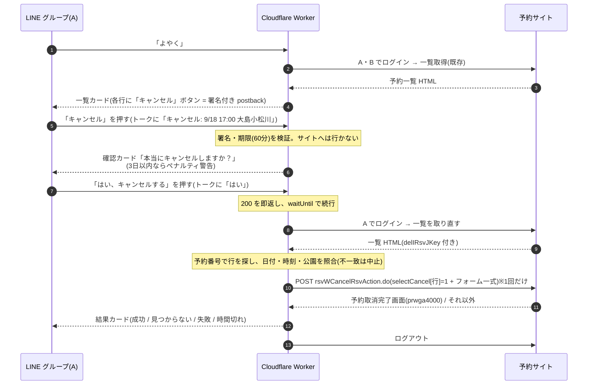

# 予約空き監視・LINE通知システム 要件定義書

作成日: 2026-08-31 / 最終更新: 2026-09-17(フェーズ3 の本稼働と仕様変更、フェーズ4 を §14 に追加、フェーズ5 テニスベア合流を §15 に追加し同日実装・稼働)

**ステータス: フェーズ1は2026-09-01より本稼働中**(3分おきチェック・グループLINE通知)
**フェーズ1.5(予約確認ボット)は2026-09-02より稼働中**(§11)
**フェーズ1.6(キャンセル)は2026-09-06より、フェーズ2(予約支援)は2026-09-13より稼働中**(§12、`docs/引き継ぎ_フェーズ2運用.md`)
**フェーズ3(自動予約)は2026-09-17 14:20より本稼働中**(§13。dry-run 3 日と実枠テストを経て `AUTO_BOOKING=on`)
**フェーズ4(ペナルティ予告アラート)は2026-09-17より稼働中**(§14。毎日 9:00 と 23:35)
**フェーズ5(「よやく」にテニスベアの予定を合流)は2026-09-17 17:24より稼働中**(§15。A は 2026-09-17、B は 2026-09-18 に Secrets 登録済み)

## 1. 目的

特定の予約サイトの空き状況を定期的に自動チェックし、新しく空きが出たときだけ自分のLINEに通知を受け取る。

## 対象サイト(確定)

- 東京都スポーツ施設予約システム
- URL: https://kouen.sports.metro.tokyo.lg.jp/web/index.jsp
  - ※2023年のリニューアルでURLはそのまま中身だけ新システム化されており、このURLが現行の入口(2026-08-31 実機確認済み)。yoyaku.sports系URLは別システムのため使わない
- ログイン: 空き状況の照会だけなら不要(実機確認済み)。フェーズ1ではログイン処理・認証情報の保管は行わない。ログインが必要になるのは予約を実行するフェーズ2から
- 特記事項:
  - 週表示カレンダーは内部のJSON APIから描画されているため、**ブラウザ自動化(Playwright)は不要**で、素のHTTP(Node標準fetch+Cookie持ち回り)でAPIを直接叩ける(当初想定から方式変更。§3参照)
  - レスポンスの文字コードはShift_JIS(Windows-31J)
  - サーバはやや不安定(一時的な502、セッション未認識のまま200が返るパターンあり)なため、公園単位で新セッションからのリトライ(最大3回)を実装済み
  - 夜間・定期メンテナンス時間帯はチェックをスキップする設計

## 監視対象(確定)

- 種目: テニス(人工芝) — サイト内部コード `1000_1030`
- 休日の定義: 日本の土日祝(祝日判定には japanese-holidays を使用)

| 区分 | 施設 | 公園コード | 時間帯 |
|---|---|---|---|
| 平日 | 猿江恩賜公園 | 1040 | 19時の枠のみ |
| 土日祝 | 猿江恩賜公園 | 1040 | 全ての時間 |
| 土日祝 | 亀戸中央公園 | 1050 | 全ての時間 |
| 土日祝 | 大島小松川公園 | 1160 | 全ての時間 |

- 公園コードは現行システムの調査結果(旧システムの05/06/24は廃止)。定義は `lib/config.js` に一元化
- 時間帯は9〜21時の2時間枠×6本(9/11/13/15/17/19時開始)。平日監視対象の19:00-21:00枠は存在する

### 「空き」の判定方法(確定)

内部APIが返す週単位の空き状況JSONから、対象枠の空き面数が1以上のものを「空きあり」と判定する(画面上の🟣記号に相当)。詳細な調査記録は `docs/site-notes.md` 参照。

### 通知の形式(確定)

- カード型のFlex Messageで通知(日付チップ: 土=青/日祝=赤/平日=グレー、残1面はオレンジ強調、予約サイトへのリンクボタン付き)
- 施設名・日付・時間帯・空き枠数を含める。1通に最大12件表示、超過分は「…ほかN件」(LINEのFlex 10KB制限対策)
- 通知先はユーザーID(`U`〜)またはグループID(`C`〜)。現運用はグループ宛て(A・B・ボットのグループ)

## 2. 方針(決定済み)

- AI(Claude)に毎回チェックさせる方式は、高頻度実行だと月1.5万〜6万円程度かかるため不採用。
- GitHub Actions + Node.js による構成を採用。ランニングコストはほぼ0円。
- 当初はPlaywright(ブラウザ自動化)を想定していたが、内部JSON APIを直接叩ける事が判明したため**HTTP直叩き方式に変更**(実装済み)。依存はjapanese-holidaysの1個のみ、1回の実行は約1.5〜2分
- スコープはフェーズ1(通知のみ)。LINEのボタンから予約まで行うフェーズ2は将来対応とする。

## 3. システム構成(フェーズ1)

| 部品 | 役割 | サービス | 費用 |
|---|---|---|---|
| 定期起動 | 3分おきにworkflow_dispatch APIを叩いてActionsを起動 | cron-job.org(無料) | 無料 |
| 実行環境 | 起動されたworkflowで空きチェックスクリプトを実行 | GitHub Actions | 無料枠内 |
| 空きチェック | 内部JSON APIをHTTPで直接叩いて空きを判定 | Node.js(標準fetch) | 無料 |
| 状態保存 | 前回結果をstate.jsonに保存し、変化した時だけ通知(重複通知防止) | リポジトリ内ファイル | 無料 |
| 通知 | 空き検知時に自分のLINEへpush通知 | LINE Messaging API | 無料枠(月200通)内 |

処理フロー:
cron-job.org(3分おき)→ workflow_dispatch APIでGitHub Actionsを起動 → Node.jsが内部APIで空き取得(公園ごとにセッション取得→検索条件POST→週JSON取得を5週分)→ 監視条件で絞り込み → 前回結果と比較 → 新しい空きがあればLINE Messaging APIでpush → グループLINEに通知が届く

APIフロー詳細:
1. `GET /web/index.jsp` でセッションCookie取得
2. `POST /web/rsvWOpeInstSrchVacantAction.do` で検索条件をセッションに載せる(公園ごと)
3. `POST /web/rsvWOpeInstSrchVacantAjaxAction.do` で1週間分の空きがJSONで返る(useDayを+7日しながら5週分)

## 4. 監視仕様(確定)

- **監視範囲**: 当日から1ヶ月分(週送りで5週分取得)
- **稼働時間**: 24時間監視。ただしサイト側の定期メンテナンス中(毎月27日12:00〜28日8:45、年末年始12/28 12:00〜1/4 8:45)はエラーではなく「スキップ」として静かに扱う(lib/maintenance.js)。深夜のLINE通知はスマホのおやすみモード等で対処し、システム側では制御しない
- **リポジトリ**: public(決定)。publicリポジトリはGitHub Actionsの実行時間が無料・無制限。コードと監視条件は公開されるが、トークン等はSecretsのため公開されない
- **チェック間隔**: **3分おき**(実効遅延は平均約3.5分。サイトアクセスは約7,300回/日)
- **定期起動の方式**: **cron-job.org(無料)からのworkflow_dispatch API呼び出し**(2026-09-01変更)
  - 当初のGitHub Actionsの`schedule`(cron)は、アカウントレベルで極端に間引かれる問題が発生
    (5分指定で実効3〜4時間。構文・UTC・権限等の仮説は全て検証済みで白。検証用リポジトリ
    `y-ykym/cron-canary`(観測終了により2026-09-10削除)でも同一症状を確認)したため不採用に変更
  - monitor.ymlから`schedule`トリガーは削除済み(GitHub cron正常化時の二重実行防止)
  - 認証はfine-grained PAT(対象リポジトリのみ・Actions: Read/Write・**期限1年**)。cron-job.orgの失敗時メール通知ON
  - `cron-canary`による観測は終了し、リポジトリは2026-09-10に削除。GitHub cronの正常化を確認できた場合のみ`schedule`に戻しcron-job.orgを停止する(手順はREADME運用メモ)
  - 同時実行の重複を防ぐため、workflowに concurrency 設定を入れて前の実行が終わってから次を動かす
- **利用規約**: 確認済み。自動アクセスに関する問題なし
- **運用上の注意**:
  - state.jsonの保存はpush競合(実行中に人間がpushした場合)に備え `git pull --rebase -X theirs`+リトライ3回で確実に行う(失敗すると同じ空きを二重通知するため)
  - 「60日活動なしでscheduled workflow自動停止」ルールは、外部トリガー化により当面は無関係。GitHub cronの`schedule`に戻した際は再び適用される(state.jsonの自動コミットで通常は維持)
  - **1年後にfine-grained PATの期限が切れる**ので、cron-job.org側の再設定が必要(2027-09頃)

## 5. 事前準備(ユーザー側の作業) — 完了済み

1. ~~GitHubアカウントを用意し、publicリポジトリを1つ作成~~ ✅
2. ~~LINE Developersで無料のMessaging APIチャネル(公式アカウント)を作成~~ ✅
3. ~~チャネルアクセストークンと自分のユーザーIDを取得~~ ✅
4. ~~上記2つをGitHubリポジトリのSecretsに登録(LINE_CHANNEL_ACCESS_TOKEN / LINE_USER_ID)~~ ✅

## 6. 成果物(フェーズ1)

- `check.js` — メイン処理(取得→絞込→差分→通知→保存)
- `lib/scrape.js` — 内部APIからの空き取得(リトライ込み)
- `lib/config.js` — 公園定義・監視条件の一元管理(公園の増減はここだけ編集)
- `lib/filter.js` / `lib/state.js` / `lib/notify.js` / `lib/date.js` / `lib/maintenance.js` — 絞込・差分・LINE通知(Flex Message)・JST日付処理・メンテ判定
- `.github/workflows/monitor.yml` — 定期実行のGitHub Actions設定
- `state.json` — 前回の空き状況(自動更新)
- `README.md` — セットアップ手順書
- `docs/site-notes.md` — サイト調査記録(API仕様・コード表)

## 7. 注意点・制約

- GitHub Actionsのcronは混雑時に数分〜十数分遅れることがある。分単位の即時性が必要なら格安VPS(月500円程度)に移行する。
- 内部APIは非公開仕様のため、サイト改修でJSON形式やエンドポイントが変わるとlib/scrape.jsの修正が必要になる(Actionsの失敗ログで検知)。
- サーバ側の一時的な502等はリトライ(最大3回)で吸収。それでも失敗した回は「スキップ」扱い。

## 8. フェーズ2(将来対応): LINEのボタンから予約実行

通知のFlexカードに「予約する」ボタンを追加し、タップで該当枠を自動予約する(通知のFlex化自体はフェーズ1で実施済み)。

追加構成: LINEボタン → Cloudflare Workers(Webhook受け口・無料)→ GitHubの repository_dispatch でActionsを起動 → 予約処理を実行 → 結果をLINEに返信。

Workersを挟む理由: LINEのWebhookは送信先のヘッダーや形式をカスタマイズできず、GitHub APIを直接呼べないため、署名検証と形式変換を行う「通訳」が必要。

フェーズ2の注意点:
- 早い者勝ち問題: 予約実行直前に再度空きを確認し、埋まっていたら失敗を通知する。
- 決済の自動化は非推奨。予約確定直前で止めてURLを送るか、現地払いのサイトに限定する。
- 自動予約はサイトによって規約違反となる場合があるため事前確認が必須。

## 9. コストまとめ

- フェーズ1・2ともランニングコスト: ほぼ0円(cron-job.org含め全サービス無料枠内)
- LINE通知: 月200通まで無料(グループ宛ても1通カウント。消費ペースは見守り中)

## 10. 見守り事項(運用中)

1. GitHub cronの間引き(観測用の`cron-canary`は2026-09-10に撤去。正常化を確認できたら`schedule`へ戻しcron-job.orgを停止)
2. LINE月200通の消費ペース
3. fine-grained PATの期限(2027-09頃に再発行・再設定)
4. (フェーズ1.5)A・Bがサイトのパスワードを変えたら Workers Secrets(`SITE_PASS_A` / `SITE_PASS_B`)を更新
5. (フェーズ1.5)利用者カードの有効期限。切れるとボットのログインが失敗し「取得失敗」になる(期限更新は2週間前からマイメニューで可能)
6. (フェーズ1.5)予約サイトが reCAPTCHA を有効化したら自動ログイン不可 → 方式の見直し

## 11. フェーズ1.5: LINEグループでの予約確認ボット

**ステータス: 実装済み・2026-09-02 稼働開始**(A・B 2人分で動作確認済み。返信まで実測6〜12秒)

実装時に確定・変更した点(以下の各節の記述より本項が優先):

- **返信は Flex Message(カード)** に変更(11.2 の「Flex不使用」から変更。利用者の要望)。全員0件・全員失敗のときだけ 11.2 のテキスト文言。片方失敗はその人の区画に「取得失敗」、片方0件は「予約なし」
- **200 は即時に返し、取得・返信は Cloudflare の `waitUntil` で応答後に続ける**。LINE は Webhook の応答を長く待たず、処理してから200を返す方式では接続を切られて Worker が打ち切られた(実測)。`waitUntil` は応答後最長30秒のため、取得は25秒で打ち切り、再試行は開始10秒以内の失敗のみ、予約サイトからのログアウトは返信後に回す
- **1分超過時の push フォールバック(11.4・11.9の4・11.12の5)は不採用**(2026-09-07 判断)。稼働 5 日間で返信は常に 6〜12 秒で 1 分に迫る例が無く、実装すると月 200 通の枠を消費するため。返信できなかった場合は「よやく」を送り直す
- 11.9 の確認結果: 利用規約に自動ログインを禁じる記述なし(利用者確認済み)。B本人の同意あり。**ログイン時に CAPTCHA・SMS/MFA の追加画面は出ない**(reCAPTCHA の仕組みは組み込まれているが無効化されている。有効化されたら検知してエラーにする)。Cloudflare からのアクセスは問題なく通る
- 認証エラー(パスワード誤り・カード期限切れ)は**再試行しない**(アカウントロック防止)
- 11.11 の `lib/` 共通化は行わず、`worker/src/site.js` に考え方だけを写した(lib/scrape.js は Node 専用の fs・CommonJS に依存しており、稼働中コードを触らないため)
- 予約サイトの調査結果(ログインAPI・予約一覧HTMLの構造)は `docs/site-notes.md`「フェーズ1.5 追加調査」、運用手順は README「フェーズ1.5 予約確認ボット」に記載

### 11.1 目的

グループトークで「よやく」と送るだけで、A・B両名が予約サイト上に持っている**確定済み予約**を一覧で返す。「自分いつ取ってたっけ」「相手はいつ入れてる?」をサイトにログインせず確認できるようにする。

### 11.2 使い方(利用者から見た仕様)

- グループで `よやく` と送信 → ボットが即返信
- コマンドはこの1つのみ。出し分け・引数なし。常に全員分を返す
- 返信例

```
📅 予約一覧(9/2 現在)
・A  9/6(土)  9:00-11:00 猿江恩賜公園
・A  9/13(土) 11:00-13:00 亀戸中央公園
・B  9/10(水) 19:00-21:00 猿江恩賜公園
```

- 予約が1件もない場合: `予約はありません`
- 取得に失敗した場合: `予約サイトに繋がりませんでした。少し待ってもう一度お試しください`
- 返信は通常のテキストメッセージ(Flex不使用。件数が少なく読みやすさ優先)

### 11.3 キーワード判定

- テキストメッセージのみ対象。前後の空白・改行を除いた上で `よやく` と**完全一致**した時だけ反応
- 「予約しといたよ」「よやくした」などには反応しない
- ひらがな3文字なのでスマホのフリック入力だけで完結(変換・スペース不要)
- 送信元が**設定済みのグループID**(現在の通知先グループ)と一致しない場合は無視(他のグループに招待されても動かない)

### 11.4 前提・LINE側の制約(公式仕様)

- グループトークにはリッチメニューを設置できない → キーワード応答方式で実現
- 応答(reply)メッセージは**無料枠の月200通にカウントされない**。この機能でLINEの通数は消費しない
- replyトークンは**受信から1分以内**に使う必要がある → 1分以内に予約サイトから取得して返す設計が必須(超過時のみpush=200通枠を消費、11.9参照)
- 公式アカウントの設定変更が必要(11.8のチェックリスト)

### 11.5 システム構成

```
LINEグループ「よやく」
  → LINE Platform が Webhook を送信
  → Cloudflare Workers(無料)
      1. 署名検証(X-Line-Signature を channel secret で検証)
      2. グループID・「よやく」完全一致を判定。違えば何もしない
      3. 予約サイトへ A と B それぞれでログイン(並行)
      4. 予約確認画面(一覧)を取得・Shift_JISをデコード・整形
      5. replyトークンで返信
  → グループに一覧が届く
```

| 部品 | 役割 | サービス | 費用 |
|---|---|---|---|
| Webhook受け口・処理本体 | 署名検証、判定、サイト照会、返信 | Cloudflare Workers(無料プラン: 10万リクエスト/日) | 無料 |
| 秘密情報 | 利用者番号・パスワード・LINEトークン等 | Cloudflare Workers Secrets | 無料 |
| 返信 | reply API | LINE Messaging API | 無料(200通枠の対象外) |

**GitHub Actionsを使わない理由**: Workflow起動は待ち時間が30秒〜数分あり、replyトークンの1分制限に間に合わない。Actions経由にするとpush送信(200通枠を消費)になってしまう。Workersなら数秒で応答できる。

**フェーズ2との関係**: フェーズ2の構成図(§8)にある「Cloudflare Workers(Webhook受け口)」と同じ部品。今回作る署名検証・LINE設定・Workersの配置がそのままフェーズ2の土台になる。フェーズ2ではこのWorkerに「ボタン押下(postback)→ repository_dispatch」の分岐を足すだけ。

**データベースを持たない理由**: 毎回サイトから取れば常に最新(キャンセル・抽選当選の確定も反映)で、登録・同期の手間がゼロ。呼ばれる頻度は1日数回以下の想定なのでサイトへの負荷も無視できる。

### 11.6 予約データの取得方法

- ログイン方式: **利用者番号 + パスワード**(公式案内より。SMS認証は利用者登録時のみ)
  - ※ログイン時にCAPTCHAやSMS認証が毎回入るかは**実機で要確認**(11.9)
- 取得対象: ログイン後の「予約確認」画面(予約一覧)。抽選当選を確定したものも通常予約と同じ一覧に載る想定
- 予約確認画面の内部API(URL・パラメータ・JSON形式)は**未調査**。フェーズ1と同じ手順(Chrome DevToolsのNetworkタブ)で調べ、結果は `docs/site-notes.md` に追記する
- 文字コードはShift_JIS(現行と同じ。`TextDecoder('shift_jis')`)
- サイトが不安定(502・セッション未認識)な既知の問題への対策は現行と同じ: 新セッションからリトライ最大2回(1分制限があるため回数は少なめ)
- 表示名: 設定値 `LABEL_A` / `LABEL_B`(例: A / B や名前)。LINEのuserIdは使わない

### 11.7 秘密情報(Cloudflare Workers Secrets)

| 名前 | 内容 |
|---|---|
| `LINE_CHANNEL_SECRET` | Webhook署名検証用(LINE Developersコンソールで取得) |
| `LINE_CHANNEL_ACCESS_TOKEN` | reply送信用(現行のGitHub Secretsと同じ値) |
| `LINE_GROUP_ID` | 反応するグループID(現行の `LINE_USER_ID` と同じ値) |
| `SITE_USER_A` / `SITE_PASS_A` | Aの利用者番号・パスワード |
| `SITE_USER_B` / `SITE_PASS_B` | Bの利用者番号・パスワード |
| `LABEL_A` / `LABEL_B` | 返信に表示する名前 |

パスワードはコード・リポジトリに一切書かない。`wrangler secret put` で登録する。Bの認証情報はB本人が同意した上で預かる(11.9)。

### 11.8 LINE公式アカウント側の設定チェックリスト

LINE Developersコンソール(Messaging API設定)

- [ ] Webhook URL に WorkersのURL(`https://xxx.workers.dev/webhook`)を設定
- [ ] 「Webhookの利用」を **ON**
- [ ] 「グループトーク・複数人トークへの参加を許可する」を **ON**(デフォルトOFF。既にグループに入って通知できているなら済んでいる可能性が高いので確認のみ)
- [ ] 「検証」ボタンで疎通確認(Workersが200を返せばOK)

LINE Official Account Manager(応答設定)

- [ ] 「応答メッセージ」を **OFF**(ONのままだと「よやく」以外の全発言に定型文が返ってしまう)
- [ ] 「あいさつメッセージ」は任意(OFF推奨)
- [ ] 「Webhook」を **ON**

### 11.9 リスク・要確認事項

1. **利用規約**: フェーズ1(ログイン不要の照会)と違い、本人アカウントで**自動ログイン**する。フェーズ2と同じ論点なので、規約・利用案内に自動ログインを禁じる記述がないか着手前に確認する
2. **B の認証情報を預かること**: 利用案内に「利用カードを第三者へ貸し出すと登録抹消」の規定がある。今回は本人の予約を本人のために照会するだけだが、Bの利用者番号・パスワードをYu管理のCloudflareに置く点はB本人の同意を必ず取る。不安があれば「Bの分は手入力登録方式」に切り替える(11.10)
3. **ログインに毎回CAPTCHA/SMSがある場合**: 自動ログイン不可。この場合は方式を「LINEから手入力で登録(例: `とうろく 9/10 19時 猿江`)」に変更する。着手の最初にこれを実機確認する
4. **1分制限**: ログイン+取得が1分を超えるとreplyできない。対策として(a) A・Bを並行取得、(b) 超過時のみpushで送る(200通枠を消費)。通常は数秒で終わる想定
5. **WorkersのアクセスIP**: Cloudflareのデータセンター経由でのアクセス。現行のGitHub Actions(海外IP)で問題ないため通る見込みだが、疎通は最初に確認する
6. **パスワード変更・カード期限**: 本人がサイトのパスワードを変えたらSecretsも更新が必要。利用者カード期限切れでログイン不可になる → 失敗メッセージで気づける
7. **なりすまし・誤爆**: 署名検証+グループID一致で防ぐ。1対1トークで「よやく」と送られても反応しない

### 11.10 やらないこと(スコープ外)

- リッチメニュー・常設ボタン(グループでは仕様上不可)
- クイックリプライ・Flexのボタン(確認だけなら不要。フェーズ2の「予約する」「キャンセル」で検討)
- ユーザーごと・名前指定の出し分け
- 予約データのDB保存・手入力登録(11.9の3・2に該当した場合のみ代替として採用)
- サイト側の予約変更・キャンセル操作(※キャンセルは §12 で追加。予約変更は引き続きスコープ外)

### 11.11 成果物

- `worker/src/index.js` — Webhook受け口(署名検証・判定・サイト照会・返信)
- `worker/wrangler.toml` — Workers設定(Secretsは含めない)
- `lib/` の共通化: Shift_JISデコード・セッション取得の処理を `worker/` からも使えるよう切り出す(可能な範囲で)
- `docs/site-notes.md` 追記 — ログインAPI・予約確認APIの調査結果
- `README.md` 追記 — Workersの配置手順、LINE設定チェックリスト、Secrets一覧

### 11.12 実装の進め方(順番)

1. LINE設定変更(11.8)と、Cloudflareアカウント作成(無料)
2. 「よやく」に固定文言を返すだけの最小Workerを配置し、グループで疎通確認(ここまでで LINE側の疑問は全て解消)
3. 実機で予約サイトのログイン・予約確認画面をDevToolsで調査 → CAPTCHA/SMSの有無をここで判定(11.9の3)。site-notes.mdに記録
4. Workerにログイン・取得・整形を実装。まずAの分だけで動作確認 → Bを追加
5. エラー時メッセージ・1分超過時のpushフォールバックを入れて本稼働

### 11.13 コスト

ランニングコスト 0円(Cloudflare Workers無料プラン・LINE reply無料)。既存の月200通枠も消費しない(1分超過時のpushのみ例外)。

## 12. フェーズ1.6: LINEからの予約キャンセル

**ステータス: 完了・稼働中(2026-09-06 配置、2026-09-07 完了判定)。使い捨て予約(9/18 亀戸中央)で一覧 → 確認 → 取消成功まで実機確認済み**

実装時に確定した点(以下の各節の記述より本項が優先):

- postback data は `c|A|予約番号|YYYYMMDD|HHMM|HHMM|公園名|penaltyday|期限.署名` の約 80 文字(`worker/src/cancel-token.js`)。
  終了時刻も入れて確認カードに「17:00 - 19:00」を出す。公園名はコードではなくサイト表記をそのまま入れる(照合に使う)
- 「いいえ」の postback data は署名無しの `n`(サイトへ行かず文言を返すだけなので検証不要)
- 署名不正の postback は返信せず無視(ログのみ)。期限切れは「時間切れです」を返す。`CANCEL_ENABLED` が "1" 以外のときに
  古いカードのボタンが押されたら「キャンセル機能は現在停止しています」を返す
- 取消 POST 後の応答が完了画面でない(`failed`)と、POST 自体が失敗(`unknown`)はどちらも「キャンセルできませんでした」カード。
  一覧に無い(`not_found`)・内容不一致(`mismatch`)はテキストで返す
- 一覧カードの行数は固定値ではなく 28,000 バイトに収まるまで減らす(実測: ボタン付き 7 行 ≒ 9.0KB)
- 配置手順・実機テスト手順・トラブル時の見方は README「フェーズ1.6 予約キャンセル」

事前調査(`docs/site-notes.md`「キャンセル機能の事前調査」)で確定した前提:

- 予約サイトの取消導線(一覧画面 → 「キャンセル」→ 完了画面)に **reCAPTCHA は無い**。取消は一覧画面のフォーム一式に `selectCancel[行]=1` を付けて `POST rsvWCancelRsvAction.do` する **1回の POST で即時確定**し、確認画面は挟まらない
- 応答が予約取消完了画面(`prwga4000.jsp`)なら成功。取消後の一覧から該当行は消える
- したがって **フェーズ1.5 の Worker(HTTP 直叩き)に足すだけで実現できる**。ブラウザ・Raspberry Pi は不要

### 12.1 目的

「よやく」で出た予約一覧から、サイトにログインせずに予約を取り消せるようにする。誤操作で取り消せない操作をしてしまわないよう、**必ず 2 段階の確認**を挟む。

### 12.2 使い方(利用者から見た仕様)

1. グループで `よやく` → 予約一覧カード(既存)。**各予約の行に「キャンセル」ボタン**が付く(終了済みの枠には付けない)
2. 「キャンセル」を押す → ボットが確認カードを返信
   ```
   本当にキャンセルしますか？
   A  9/18(金) 17:00-19:00 大島小松川公園
   [ はい、キャンセルする ]  [ いいえ ]
   ```
   - 利用日が近い(12.5)場合は先頭に **「⚠ 利用日が3日以内のためペナルティ(1点)が付きます」** を出す
3. 「はい、キャンセルする」を押す → ボットが予約サイトで取消を実行し、結果を返信
   - 成功: `キャンセルしました  A 9/18(金) 17:00-19:00 大島小松川公園`(直後に `よやく` で一覧から消えていることを確認できる)
   - 一覧に見つからない: `この予約は見つかりませんでした(既にキャンセル済みの可能性があります)。「よやく」で確認してください`
   - 失敗(サイト不調・想定外画面): `キャンセルできませんでした。予約サイトで状態を確認してください`(**取消されたか不明なときも同じ文言**で、必ず確認を促す)
   - 期限切れ(12.4): `時間切れです。「よやく」からやり直してください`
4. 「いいえ」を押す → `キャンセルしませんでした`

- ボタン押下は LINE の postback で送り、**押した内容はトークにも表示する**(`displayText`。例:「キャンセル: 9/18 17:00 大島小松川」「はい」)。誰がいつ押したかがグループに残る
- 誰の予約でも、グループのメンバーなら取り消せる(2人グループで相互了解済みの前提。制限したくなったら LINE userId と A/B の対応を Secrets に持たせて絞る)

### 12.3 構成図と処理の流れ

構成図: `docs/system-overview-cancel.html`(画像版 `docs/system-overview-cancel.png`)。登場するのは **LINE グループ・Cloudflare Worker・予約サイトの 3 つだけ**で、既存の「よやく」ボットに postback の分岐を足す。



- 取消の POST は **絶対に再試行しない**(成否不明のまま2回送らない)。再試行はログイン・一覧取得(POST 前)に限り、開始10秒以内のみ(既存と同じ)
- 一覧の行 index は表示のたびに変わり得るため、**postback の data に index は入れない**。予約番号(+日付・時刻・公園)で毎回探し直す
- `delIRsvJKey` は一覧を取得したセッションのものをそのまま送る(ログイン〜取消は同じセッションで完結させる)
- 所要は通常の画面遷移 4〜5 回分(実測ベースで 6〜15 秒見込み)。既存の 25 秒予算に収まる

### 12.4 postback データと安全対策

- data は `booking.js` と同じ形式の **署名付きトークン**(base64url(JSON).base64url(HMAC-SHA256))。鍵は既存の `BOOKING_SIGNING_SECRET` を流用
- 中身: `{kind:'cancel'|'cancel-confirm', person:'A'|'B', id:予約番号, date, start, park, exp}`。LINE の postback data 上限 300 文字に収める
- 有効期限: 「キャンセル」ボタンは一覧表示から **60 分**、「はい」は確認カードから **10 分**。期限切れは 12.2 の文言で拒否
- 署名不正・グループ不一致・期限切れの postback は何もしない(または拒否文言)。メッセージ本文からは絶対にキャンセルを受け付けない(「キャンセル」と打っても反応しない)
- 二重押し(「はい」を2回)は 2 回目が「見つかりません」になるだけで害はない。KV 等での使用済み管理はしない
- LINE Developers の「Webhookの再送」は引き続き **OFF**(ON だと同じ postback が再配送される)
- ログに予約番号・氏名・利用者番号・Cookie・トークンは出さない。日付・時刻・公園・結果種別のみ

### 12.5 ペナルティ判定

サイトの取消ボタンの JS(`prwha1000.js` の `rsvcancel`)と同じ判定を Worker 側で行う:

- 一覧の hidden `penaltydayN`(現在 3)と `usedayN` を使い、**利用日 ≤ 今日(JST)+ penaltyday 日** なら「ペナルティあり」
- 日付のみで比較する(時刻は見ない)。サイトの規定では「テニスは利用日の4日前までキャンセル可能、以後は直前キャンセル1点(無断2点)」
- ペナルティありでも取消自体は可能。確認カードで警告し、本人が「はい」を押せば実行する
- 一覧の hidden を読む都合上、`parseReservations` に `penaltyDay`(と行 index 用の `useday`/`stime`)を追加する

### 12.6 表示(Flex)のデザイン(2026-09-06 最適化)

見た目の比較と押した後の流れのモック: `docs/flex-design-cancel.html`(画像版 `docs/flex-design-cancel.png`)。

**一覧カード(既存の見た目は据え置き、ボタンを追加)**

- 各行の右端に小さな「キャンセル」ピル(薄い赤地・赤文字、postback)。終了済みの行には付けない
- ピルの幅(約 70px)を確保するため、時間の文字を一段小さく(lg → md、太字は維持)し、「今日/明日/終了」の補足は時間の右から公園名の右へ移す
  (mega バブルの本文幅 約268px に、日付タイル 52px + 時間 + ピルを 1 行で収めるため。折り返すと Flex では省略記号になる)
- ヘッダー右に「M/D 現在 ・ N件」(合計件数を追加)
- 日付タイルの配色(土=青/日祝=赤/平日=グレー/終了=薄グレー)、人ごとのラベルと件数、フッターの「予約サイトを開く」はそのまま

**サイズ設計(バブル 30KB 制限への対応。2026-09-13 にリファレンスで確認、以前は 10KB)**

- 現行は 1 行 約0.9KB・固定部 約1.8KB で 9 行 ≒ 9.0KB。ボタンをそのまま足すと 1 行 1.3〜1.5KB になり 5〜6 行しか載らない
- そこで JSON を軽量化する: 時間+公園名+補足を span 1 テキストに(box と text の数を減らす)、ピルの装飾を最小限に、
  postback data を `c|A|予約番号|YYYYMMDD|HHMM|HHMM|公園名|penaltyday|期限.署名` の **約 80 文字**に(署名は HMAC-SHA256 先頭 16 バイトの base64url)
- 日付タイルも span 1 テキスト + 改行で軽くする案だったが、**実機(文字サイズ大)で「9/1」「8」に折れた**ため 2 テキスト(幅 58px)に戻し、
  日付は `adjustMode: shrink-to-fit` で 1 行に収める(2026-09-06 実機確認)
- 実測: 1 行 約1.1KB(ボタン込み)、7 行で 9,278 バイト、8 行で超過 → **表示上限は 7 行**。
  ただし固定値にせず、`lib/notify.js` と同じく「28,000 バイトに収まるまで行を減らす」方式で自動的に決め、超過分は「…ほかN件」
- displayText(押したときにトークへ出る本文)は「9/7 17:00 大島小松川公園 をキャンセル」の形

**確認カード**(琥珀色ヘッダー「キャンセルの確認 / 10分以内に選択」)

- 「この予約をキャンセルしますか？」+ 対象の予約(日付タイル・時間・公園・種目)+ 人のラベル・予約番号(支払状況は表示しない)
- 該当時のみ黄色の警告枠「⚠ 利用日が3日以内のため、キャンセルするとペナルティ(1点)が付きます」
- フッターはボタンを**縦積み・全幅**で「はい、キャンセルする」(赤)の下に「いいえ」(グレー)。
  横並びにすると実機で「はい、キャンセル…」と省略されたため(2026-09-06 実機確認)

**結果カード**

- 成功: 緑ヘッダー「キャンセルしました」+ 取り消した予約(打ち消し線)+ 予約番号
- 失敗: グレーヘッダー「キャンセルできませんでした」+「予約サイトで状態を確認してください」。成否不明のときも同じカード
- 見つからない・時間切れ・「いいえ」はテキストで返す(12.2 の文言)
- いずれも Flex が 400 で拒否されたときはテキスト版で再送(既存と同じ方針)

### 12.7 秘密情報・設定

追加の Secret は無し(`BOOKING_SIGNING_SECRET` は Worker に登録済み)。段階導入のため環境変数 `CANCEL_ENABLED=1` のときだけボタンを出す(`wrangler.toml` の `[vars]`)。

### 12.8 リスク・要確認事項

1. **取り消せない操作**である。2段階確認・押した内容のトーク表示・日付照合の3点で誤取消を防ぐ。それでも「他人の予約を押してしまう」余地は残るため、初期は 2 人グループ限定の前提で運用する
2. **支払済予約の取消**はサイト側の規定次第(未確認)。ボット側では特別扱いせず、支払状況も表示しない
3. **成否不明ケース**(POST 後にタイムアウト・応答が想定外): 取消されている可能性があるため、必ず「サイトで確認」を促し、自動では再送しない
4. サイト改修で一覧の hidden 名や完了画面(`prwga4000`)が変わると動かなくなる。成功判定は jsp 名コメントと本文「予約の取消が完了しました。」の両方で行い、どちらも無ければ失敗扱いにする
5. 実機テストは今回と同様に **使い捨ての予約を取ってから**行う(本番の予約で試さない)

### 12.9 やらないこと

- 抽選申込みの取消、付帯設備予約の取消、予約変更(日時変更)、複数件の一括取消
- メッセージ本文(「キャンセル 9/18」など)による取消受付
- 取消履歴の保存(必要なら LINE のトーク履歴で足りる)
- push による通知(reply のみ。200通枠は使わない)

### 12.10 成果物と進め方

1. `worker/src/site.js`: 一覧解析に `penaltyDay`・`useday`・`stime` を追加、`cancelReservation()`(一覧取得→照合→POST→完了判定)を追加
2. `worker/src/line.js`: postback イベントの抽出、`worker/src/booking.js` のトークン署名・検証を流用
3. `worker/src/flex.js`: 行ボタンの追加と表示上限の再計算。確認カード・結果カードを追加
4. `worker/src/index.js`: postback の分岐(確認 → 実行)
5. `worker/test/`: 取消 POST の body 組み立て・完了画面判定・ペナルティ判定・トークンのユニットテスト(fixture は個人情報をダミー化)
6. 使い捨て予約で実機テスト → `CANCEL_ENABLED=1` で本稼働。README に使い方と注意(取り消せない・ペナルティ)を追記

## 13. フェーズ3: 監視中の枠の自動予約

**ステータス: 2026-09-17 14:20 から本稼働(`AUTO_BOOKING=on`)。2026-09-14 要件確定・実装、9/15〜17 dry-run、9/17 実枠テスト(ログイン → 一覧 → 検索 → 枠選択 → 上限で見送りまで確認)。
自動予約の成功の流れ(成功カード・+4 日のキャンセルボタン・除外枠)は初回の成功で確認する**

要件の一次資料は `docs/PROMPT_フェーズ3_自動予約.md`(§2 要件表・§3 実測データ・§4 期待する動きの例)。本節はその要約と、実装で確定した点。

### 13.1 目的

空きが出てから予約完了までを 1.5〜2.5 分に縮め、他人のキャンセル分(残 1 面、中央値 6 分で消える)の争奪に勝てるようにする。
フェーズ1(通知)→ 人がボタンを押す → フェーズ2(Pi が予約)の経路は 4〜6 分かかり大半に負けていた(2 週間で 69 件出現、63 件が他人に取られた)。

### 13.2 要件(確定)

| # | 要件 | 確定した解釈 |
|---|---|---|
| 1 | 空きが出たら自動で予約 | 対象は監視条件を通った「新しく出た空き」。空きのチェックは **Pi 側で 1 分おき**(Actions の 3 分は通知用と、Pi 停止時の受け皿として残す) |
| 2 | ペナルティ期間は自動予約しない | 利用日 ≤ 今日(JST)+3 日 は対象外(`penaltyday=3`。定数 `AUTO_BOOKING.PENALTY_DAYS`)。従来どおり通知(予約ボタン付き)。**利用日 = 今日+4 日は対象**(ペナルティなしの取消は当日 23:59 までなので #6 の警告) |
| 3 | 1 日最大 1 枠(2026-09-17 に 2 → 1) | **利用日ごと**、**手動分も数える**。予約直前にログインして予約一覧(prwha1000)を見て数える。同じ実行の成立分も数える |
| 4 | 場所の優先順 | 平日: 猿江のみ。休日: 大島小松川 > 猿江恩賜 > 亀戸中央。同じ利用日は 公園 → 時間帯(11 > 9 > 15 > 13 > 17 > 19。2026-09-17 変更)の順に試し、上限に達したら残りは見送り。失敗は次の候補へ |
| 5 | 対象枠は空き通知しない | 見送り(その日に既に予約がある・上位を取った)も失敗も空き通知しない。**Pi の自動予約が動いていないときだけ** Actions が従来の通知カードを送る |
| 6' | 失敗の結果カード(2026-09-14・17 決定) | LINE の通数節約のため、「先に取られた(taken)」「サイトが断った(duplicate)」「サイトのエラー(error)」は結果カードを送らずログのみ。ログインできない(auth_error)・reCAPTCHA で拒否(rejected)は送る(放置すると自動予約が止まるため)。手動ボタンの失敗カードは従来どおり全部送る |
| 5' | 従来の空き通知の表示(2026-09-17 追加) | ペナルティ期間(利用日 ≤ 今日+3 日)の日には「⚠ 取消にペナルティ」を添える |
| 6 | 成功したら LINE 通知 | 既存の結果カードに「(自動予約)」。利用日 = 今日+4 日の成功カードには「⚠ ペナルティなしで取り消せるのは今日 23:59 まで」とキャンセルボタン(`c|…` トークン、期限 23:59:59)。このボタンから取り消した枠も #9 の除外枠 |
| 7 | 平日 B / 休日 A | **利用日**の曜日。祝日は休日(`isWeekendOrHoliday`) |
| 8 | 除外日 | LINE「じどう」→ 一覧カード + 「日を追加」(日付ピッカー、今日〜35 日先)。各日に「解除」。A/B 共通・1 日単位。除外日の枠は自動予約せず、**空き通知もしない**(2026-09-17 変更。それまでは従来の通知に回していた)。過ぎた日は自動で消える |
| 9 | LINE からキャンセルした枠は取り直さない | 取消成功で枠(公園・利用日・開始時刻)を除外枠に記録(A/B 共通)。空きとして再出現しても自動予約せず通知もしない。開始時刻を過ぎたら消える。「じどう」で一覧表示・解除できる |
| 10 | 全体の上限 | 不要 |
| 11 | 日付境界と締切(2026-09-14 追加) | (a) 対象判定は**「予約」の直前にもう一度**行う(23:59 に見つけた +4 日の枠を 00:01 に予約すると +3 日になる)。予約直前に対象外になった枠は予約せず、**Pi 自身が従来の空き通知カードを送る**。(b) **利用日 = 今日+4 日の枠は 23:35 以降は自動予約しない**(`AUTO_BOOKING.LAST_DAY_DEADLINE`)。締切後は従来の通知(Actions)。+5 日以降に締切なし |

その他: 人数 2 人、reCAPTCHA v2 は既存の「🔐 確認が必要です」で人が対応(回避しない)、同じ枠を二重に試さない(枠キーで冪等)、ログインを伴うアクセスは予約実行時のみ。

### 13.3 構成と分担

```
[Pi: booking/src/auto-runner.js]  1 分おき: 空き照会(lib/scrape.js)→ 監視条件(lib/filter.js)→ 差分(auto-state.js)
                                   → Worker へ heartbeat(POST /auto/heartbeat。応答で除外日・除外枠)→ 振り分け(lib/auto-rules.js)
                                   → 予約の行列(booking-queue.js。手動優先・1 件ずつ)→ reserve()(ログイン直後に予約一覧で件数判定)→ 結果カード
[Actions: check.js]                3 分おき: 空き照会 → 差分 → GET /auto/state(Pi の生存・除外一覧)→ 生きていれば対象期間の枠を通知から外す
[Worker: worker/src/auto.js]       KV: auto_exclusions(除外日・除外枠)。Pi の生存は KV に書かず /auto/status を直接 probe
                                   「じどう」カード、postback 'x|…'、キャンセル成功時の除外枠記録(返信より先に KV へ)
```

- **共通コード**: `lib/config.js`(優先順・定数)、`lib/auto-rules.js`(判断ルール)、`lib/auto-client.js`(Worker API の署名付き呼び出し)を Actions と Pi が共用。
  Docker のビルドコンテキストをリポジトリ直下にして `lib/` と root の依存(japanese-holidays)をリポジトリと同じ配置で同梱(二重管理しない)
- **枠キー**: `<公園コード>|<YYYY-MM-DD>|<HH:MM>`(公園名の表記揺れに影響されない)。Worker も同じ形式
- **API の認証**: `x-booking-ts`(送信時刻)+ `x-booking-auth = HMAC-SHA256(secret, "ts\nMETHOD path\nbody")`。ts が ±5 分以内。鍵は既存の `BOOKING_SIGNING_SECRET`
- **Pi 不達の判定**: Worker が Pi の `/auto/status` をトンネル越しに直接聞き、mode=on かつ最後の照会が 5 分以内なら生きている扱い。dry-run は alive だが active=false → Actions は全部通知。
  Pi の生存を KV に書く方式は KV 無料枠(書き込み 1,000 回/日)を超えたため 2026-09-16 に廃止
- **照会の頻度**(2026-09-17 調整): Pi は 21:00〜翌 1:00 は 1 分、7:00〜21:00 は 2 分、1:00〜7:00 は 3 分おき(`AUTO_BOOKING.POLL_SCHEDULE`)。取得範囲は 5 週 → 4 週(28 日)。サーバーへの負荷は合計で平均 0.26 回/秒
- **手動優先**: 手動ボタンは待ち行列の自動予約の前に入る(実行中の自動は中断しない。40〜90 秒待つ)。手動同士は従来どおり busy
- **初回起動の暴走防止**: 状態ファイルが無い、または 10 分より古ければ「いま見えている空き」を既知として登録し予約しない
- **手放しの検出**: Pi が自動予約した枠が、次にその人の予約一覧を見たときに無ければ除外枠として Worker に登録(サイトで直接取り消した場合)
- **予約直前の再判定**(#11): 行列の中で実行する直前に `classifySlot(now)` をやり直す。対象外(ペナルティ期間・締切後・除外日)なら Pi が `lib/notify.js` の従来カードを push、除外枠ならカードなし。
  見つけた時点で対象外の枠は Pi は触らず Actions が通知する。境界の数分では両方から届くことがある(許容)
- **除外枠の記録**(#9): 「よやく」の一覧カードのキャンセルも、+4 日の成功カードのキャンセルボタンも Worker の同じ取消処理(`buildPostbackReply` の kind='y')を通り、
  取消 POST 完了 → KV `auto_exclusions` へ書き込み → LINE 返信 の順(テストで順序を確認)。Pi は次の heartbeat(1 分以内)で受け取る
- **Pi の照会ループの見張り**: 既存の毎時監視に追加。予約サーバーは応答するのに mode=on の heartbeat が 15 分以上無ければ ⚠️ を 1 回、戻れば ✅

### 13.4 Pi 側の設定・モード

`.env` の `AUTO_BOOKING`: `off`(既定。ループを起動しない)/ `dry-run`(照会・振り分けのログのみ。予約しない)/ `on`(現在)。`AUTO_POLL_MS`(既定 60000、下限 30000。時間帯別の間隔は `lib/config.js` の `POLL_SCHEDULE`)。
状態は docker volume の `/var/lib/booking/auto-state.json`。実枠テスト用に `/var/lib/booking/forget-keys.txt` に枠キーを書くと、その枠を「新しく出た」扱いにできる。新しい Secret・Variable は不要。

### 13.4' 2026-09-17 の仕様変更(本人指示。§13.2 の表に反映済み)

- 除外日の枠は自動予約せず、空き通知もしない(それまでは従来の通知に回していた)
- 従来の空き通知カードで、ペナルティ期間(利用日 ≤ 今日+3 日)の日に「⚠ 取消にペナルティ」を添える
- 利用日ごとの上限を 2 件 → 1 件。時間帯の優先順を 11 > 9 > 15 > 13 > 17 > 19 時に
- 自動予約の失敗のうち「サイトのエラー」もカードを送らない(送るのは 成功・ログインできない・reCAPTCHA 拒否・人に渡して未完了)
- 成功カードの文言「無料」→「ペナルティなし」(取消に費用はかからず、付くのはペナルティ 1 点)
- 照会間隔を 21:00〜翌 1:00 は 1 分、7:00〜21:00 は 2 分、1:00〜7:00 は 3 分に(相手のサーバーへの配慮。利用規約に自動アクセスの禁止条項が無いことは本人が 9/15 に確認)
- 「その日は上限まで予約がある」という記憶は 60 分で忘れ、次はまた一覧を見て数える(取り消した後に見送り続けないため。9/17 に 15 分 → 60 分)
- ログインが拒否された(auth_error)予約者は 6 時間その人の自動予約を止め、カードは最初の 1 回だけ。理由の表示なしでログイン画面に戻された場合は一時エラーとして UI 操作でやり直す
- LINE「じどうおふ」「じどうおん」で自動予約の一時停止・再開(Worker の KV `auto_switch`。Pi は heartbeat の応答で受け取り次の照会から従う。停止中は mode='paused' を申告し Actions は全部通知)
- LINE「つうちおふ」「つうちおん」で空き通知カードの停止・再開(2026-09-18。Worker の KV `notify_switch`。Actions は `/auto/state` の `notifyEnabled`、Pi は heartbeat の応答で受け取る。結果カード・フェーズ4・「よやく」は止めない)

### 13.5 やらないこと

- reCAPTCHA の回避・偽装・自動突破。ペナルティ期間・除外日・除外枠の自動予約。30 秒未満の照会。Actions の間隔・起動方式の変更
- 利用者番号・パスワード・鍵をコード・ログ・LINE・文書に書くこと。本人の了解なしの実枠テスト

### 13.6 成果物

- `lib/config.js` `lib/auto-rules.js` `lib/auto-client.js` `lib/date.js`(拡張) `check.js`(振り分け) `test/auto-rules.test.mjs`
- `booking/src/auto-runner.js` `auto-state.js` `booking-queue.js` `cancel-token.js`、`reserve.js` / `site-inpage.js`(予約一覧の確認)、`result-flex.js`(自動予約の表記・キャンセルボタン)、
  `server/server.mjs`(行列・ループ起動・/auto/status)、`scripts/auto-tick.mjs`、`Dockerfile` / `pc/docker-compose.yml`(ビルドコンテキスト)、`booking/test/*`
- `worker/src/auto.js` `auto-flex.js`、`index.js`(「じどう」・postback・取消成功時の記録)、`line.js`(合言葉の汎用化)、`monitor.js`(照会ループの見張り)、`worker/test/auto.test.mjs`
- README「フェーズ3 自動予約」、`docs/引き継ぎ_フェーズ2運用.md`(稼働中の表・TODO)

## 14. フェーズ4: ペナルティ予告アラート

**ステータス: 2026-09-17 実装・Worker に deploy 済み。同日 23:35 から稼働**

実装と運用の詳細は README「フェーズ4 ペナルティ予告アラート」が正。本節は要件と、本人が決めた点の記録。

### 14.1 目的

予約サイトは 利用日 ≤ 今日+3 日 になった予約を取り消すとペナルティ 1 点が付く。裏返すと **利用日 = 今日+4 日の予約は、今日 23:59 までならペナルティなしで手放せる最後の日**。
フェーズ3 で自動予約が増えると「うっかり 4 日前を過ぎる」事故も増えるので、その日の予約を LINE に自動で知らせる。

### 14.2 仕様(本人決定)

| 項目 | 決定 |
|---|---|
| いつ | 毎日 9:00(予告)と 23:35(最終確認)JST。23:35 はフェーズ3 の `LAST_DAY_DEADLINE` と同じ時刻で、これ以降は +4 日の枠が自動予約されない = 対象がもう増えない |
| 何を | 利用日 = 今日+4 日 の予約だけを並べたカード(A・B まとめて日付順)。各行に「キャンセル」ボタン(フェーズ1.6 と同じ確認 →「はい」→ 取消) |
| 送らない | 対象 0 件の日は送らない(通数節約)。**23:35 は朝 9:00 と同じ内容、または減っているだけなら送らない**(2026-09-17 追加。朝に送った予約番号を KV `penalty_alert_sent` に控える。日中に増えたときだけ全件送る) |
| 例外 | 23:35 に予約サイトへ繋がらず確認できなかったときだけテキスト 1 通(朝は黙る) |
| ボタンの期限 | 今日 23:59:59。0 時を過ぎると「時間切れ」(うっかりペナルティ付きで取り消す事故を防ぐ)。承知のうえで消すときは「よやく」からペナルティ警告付きで消せる |
| 取消後 | フェーズ3 の除外枠に登録され、空きとして再出現しても自動予約しない |

### 14.3 構成

Worker の Cron(`wrangler.toml` の `[triggers]`: `0 0 * * *` = 9:00 JST、`35 14 * * *` = 23:35 JST)→ `worker/src/penalty-alert.js` が A・B の予約一覧を取り(フェーズ1.5 と同じ経路)、対象を抽出して push。
カードは `worker/src/flex.js` の `buildPenaltyAlertFlex`。追加の Secret なし。

### 14.4 LINE の通数との関係(2026-09-17 の見込み)

グループ宛の push は 1 回 2 通、無料枠は月 200 通。フェーズ3 on + フェーズ4 で 10 月は 100〜150 通の見込み
(内訳の見込み: 空き通知 35、自動予約の成功カード 30〜50、フェーズ4 30〜50、手動結果・監視・月初 10〜15)。
自動予約 1 件につき 成功カード 2 通 + フェーズ4 の予告 2〜4 通 かかるため、**行けない日は「じどう」で先に除外日にする**のが最も効く節約。
10 月の頭 1 週間で LINE の管理画面の消費を見て、月 60 通を超えるペースならフェーズ4 を 1 日 1 回にする。

## 15. フェーズ5: 「よやく」にテニスベアの予定を合流

**ステータス: 2026-09-17 要件確定・API 調査・実装(`worker/src/tennisbear.js`)・deploy・A の Secrets 登録・実機確認まで完了し稼働中。2026-09-18 10:38 に B の Secrets 登録・実機確認も完了し、A・B とも稼働中**

### 15.1 目的

テニスの予定は都の予約サイト(自分で取ったコート)と、テニスベア(www.tennisbear.net。他の人が立てた練習会やイベントに申し込むサービス)の 2 か所に分かれている。
「よやく」と送ったときに **両方まとめて日付順で見られる**ようにして、予定の見落としと二重予約を防ぐ。

### 15.2 仕様(本人決定。2026-09-17 に全項目回答)

| 項目 | 決定 |
|---|---|
| 対象アカウント | A・B 両方。ただし**まず A だけ**で動かす(B の Secrets が登録されたら自動で B も出る作りにし、未登録なら黙って飛ばす) |
| 取得内容 | テニスベアの**今後の予定すべて**。主催・参加を問わない(API は両方返すが、絞り込みをしない) |
| 並べ方 | 人ごとのカードの中で、都の予約と**日付順に完全に混ぜる**。人ごと 1 枚のカルーセルという構造は変えない |
| テニスベアの行 | `🐻 イベント名` + その下にコート名。**主催の印は付けない**(混ざって読みにくければ後から足す) |
| 都の行 | いまのまま変更しない |
| キャンセル | テニスベアの行には**付けない**(表示のみ)。キャンセルボタンは都の予約の行だけ |
| テニスベアだけ失敗 | 都の予約は普通に出し、そのカードの末尾に小さく「🐻 テニスベアの取得に失敗しました」。**黙って 0 件に見せない** |
| 都だけ失敗 | 従来どおり「予約サイトに繋がりませんでした」を出したうえで、**その下にテニスベアの予定は出す**(従来はエラー表示だけだったので要変更) |
| 日時の重複 | 自分が都で取ったコートをテニスベアのイベントにした場合、同じ日時が 2 行出る。当初は**まとめずそのまま 2 行**出すと決めたが、**2026-09-18 に「1 行にまとめる」へ変更**(実機で 2 行出ているのを確認し、件数も実態と合わなかったため)。仕様は §16.4 |
| 件数が多いとき | 既存の「…ほか N 件」(§12.6 のバイト数調整)でそのまま吸収する |
| フェーズ4 | ペナルティ予告アラートには**含めない**。ペナルティは都のシステム固有の概念のため |

### 15.3 データの取得方法(2026-09-17 に実機で調査済み)

テニスベアは JSON API で動く SPA(Nuxt)。**都の予約サイトと違い HTML の解析も Shift_JIS の扱いも不要**で、Worker の `fetch` だけで完結する(Pi・Playwright は不要)。

| 手順 | 内容 |
|---|---|
| 1 | `POST https://www.tennisbear.net/api/v3/auth/login/email` に `{ email, password }` → `{ user, token: { accessToken } }` |
| 2 | `GET https://www.tennisbear.net/api/v3/events/me/future` に `Authorization: Bearer <accessToken>` → イベントの配列 |

1 件の主なフィールド(実測):

| フィールド | 例 | 用途 |
|---|---|---|
| `id` | `1621297` | イベントページの URL に使える |
| `eventTitle` | `ストローク多め練` | 行の見出し |
| `startDatetimeString` | `2026-09-22T19:00:00.000+09:00` | 末尾が `+09:00` なので先頭 10 文字がそのまま JST の日付。11〜16 文字目が開始時刻 |
| `datetimeForDisplay` | `9/22(火祝) 19:00-21:00` | **終了時刻はここからしか取れない**(単独のフィールドが無い) |
| `place.name` | コート名 | 行の 2 段目 |
| `myInfo.isOrganizer` | `true` / `false` | 主催かどうか。今回は表示に使わないが保持しておく |

注意点:

- 時刻は `9:00` のように 1 桁で来ることがある。都の予約(`HH:MM`)と**桁を揃えないと日付順の並べ替えがずれる**
- `GET /api/v3/events/participating-event-in-progress` は「開催中」用の別物(予定があっても空が返る)。混同しないこと
- マイページの URL は `/my-page/organized-and-participated-event`(`/my-page/participated-event` はサーバーエラーになる)
- reCAPTCHA は無い(2026-09-17 確認)。ログインページに出てくる `google.com/recaptcha/api2/aframe` は広告スクリプトが埋める非表示 iframe で、認証とは無関係
- ログイン時に発行されるトークンの cookie 有効期間は約 3 年。パスワードの代わりにトークンだけを預ける案もあったが、**失効時に手作業が要るため不採用**(下記のとおりパスワード方式)

### 15.4 表示イメージ

```
┌──────────────────────────────────────┐
│ ゆうたそ              9/17 現在 ・ 4件 │
├──────────────────────────────────────┤
│ ┌────┐ 9:00 - 11:00                   │
│ │9/20│ 猿江恩賜公園        [キャンセル] │  ← 都の予約(いまのまま)
│ │ 土 │                                │
│ └────┘                                │
│ ──────────────────────────────────── │
│ ┌────┐ 19:00 - 21:00                  │
│ │9/22│ 🐻 ストローク多め練              │  ← テニスベア(ボタン無し)
│ │ 火 │ 亀戸中央公園テニスコート         │
│ └────┘                                │
├──────────────────────────────────────┤
│ 予約サイトを開く       一覧を更新      │
└──────────────────────────────────────┘
```

都とテニスベアは ①`🐻` の印 ②イベント名が出る ③キャンセルボタンの有無 の 3 点で自然に区別できる。都の行には何も足さない。

### 15.5 秘密情報(Cloudflare Workers Secrets)

**パスワード方式**(本人決定)。トークン方式は失効時に手作業が要るため不採用。

| 名前 | 中身 |
|---|---|
| `TB_EMAIL_A` / `TB_PASS_A` | A のテニスベアのメールアドレス・パスワード |
| `TB_EMAIL_B` / `TB_PASS_B` | B の同上(2026-09-18 登録済み) |

`wrangler secret put` で本人が登録する(値はコードにも設定ファイルにも書かない)。ログにメールアドレス・パスワード・トークン・イベント名を出さない。

### 15.6 やらないこと(スコープ外)

- テニスベアのイベントのキャンセル・申し込み(表示のみ)
- テニスベアのコート予約(`/my-page/reserved-court`)、過去のイベント(`/api/v3/events/me/past`)
- フェーズ4 のペナルティ予告アラートへの反映
- 空き監視(フェーズ1)・自動予約(フェーズ3)との連動

### 15.7 リスク・要確認事項

- **応答時間**: 「よやく」は LINE の仕様で 30 秒以内に返す必要がある(§11.4)。テニスベアは JSON API で速い見込みだが、**都の取得と並行**で走らせ、テニスベアが遅れても都の予約だけは必ず返るようにする(テニスベア側の上限は 12 秒程度)
- **利用規約**: 2026-09-17 に本人が確認。自動アクセスの禁止条項は**無かった**。自分のアカウントの自分のデータを「よやく」と打ったときだけ読む使い方
- **API の変更**: 非公開の内部 API なので、予告なく形が変わりうる。失敗しても都の予約の表示を壊さないこと(§15.2 の「テニスベアだけ失敗」)
- **キャンセルの誤爆防止**: テニスベアの行に都のキャンセル用トークンを付けてはならない。署名を付ける処理は**行を混ぜる前**に済ませる

### 15.8 成果物と進め方

1. `worker/src/tennisbear.js` 新規(ログイン → `/events/me/future` → 都の予約と同じ形に正規化)
2. `worker/src/index.js`(Secrets の追加、都と並行で取得、「よやく」の返信を組むところでだけ合流。**`fetchAllReservations` 自体は都のみのまま**にして、フェーズ1.6 のキャンセル照合とフェーズ4 に影響させない)
3. `worker/src/flex.js`(テニスベアの行、取得失敗の 1 行、都が失敗した人のカードにも予定を出す)
4. `worker/src/format.js`(Flex が 400 で返ったときのテキスト版)
5. `worker/test/tennisbear.test.mjs` 追加(正規化の単体テスト)、既存テストの更新
6. README に運用の記述を追加、`docs/site-notes.md` に調査記録

### 15.9 実装メモ(2026-09-17)

- 合流の場所: `index.js` の `buildReservationReply` だけ。都の一覧(`fetchAllReservations`)とテニスベア(`fetchAllTennisbear`)を `Promise.all` で並行に取り、
  都の一覧に**キャンセルの署名を付けてから** `mergeTennisbear` で各人に `tennisbear: { events } | { error }` を添える(`reservations` 配列には混ぜない)。
  フェーズ4・1.6 は `fetchAllReservations` しか見ないので影響なし
- 表示: `format.js` の `mergedRows(p)` が都 + テニスベアを日付・開始時刻の昇順に混ぜる。行の見分けは `source === 'tennisbear'`(`isTennisbear`)。
  `flex.js` の `reservationRow` はテニスベアの行に `cancelData` があってもボタンにしない(二重の防御)
- 「都が全員失敗」でもテニスベアの予定が 1 件でもあればカードを出す。「都が全員 0 件」でもテニスベアが失敗していればカードにして失敗の 1 行を出す(黙って 0 件に見せない)
- テキスト版(Flex が 400 のとき)は `・A  9/22(火) 19:00-21:00 🐻 ストローク多め練(亀戸中央公園テニスコート)`、失敗は `・A  (🐻 テニスベアの取得に失敗)`
- 疎通確認: `worker/scripts/probe-tennisbear.mjs`(`TB_EMAIL`/`TB_PASS` を環境変数で。`--flex` でカードの JSON)
- **同じ日付は 1 つのタイルにまとめる**(2026-09-17、稼働後に本人が提案・決定。見本は `docs/flex-design-grouped.html`): 日付・開始時刻の昇順に並べた予定を同じ日でまとめ、
  1 つの日付タイルの右に時間順で縦に並べる(`flex.js` の `groupByDate` / `dayRow`)。キャンセルボタンは都の予定ごと。罫線は日と日の間だけで、同じ日の中は 12px の余白(8px では 1 つの塊に見えたため実機で調整)。
  タイルはその日の予定が全部終了していればグレー(混ざっていれば通常色で、終了した枝の文字だけグレー)。「…ほかN件」と件数は予定の数で数える(変更なし)。
  テキスト版(Flex が 400 のとき)は 1 行 1 予定のまま

---

## 16. フェーズ6: 「よやく」の予約一覧に天気を出す

**ステータス: 2026-09-18 要件確定・API 調査・実装(`worker/src/weather.js` / `worker/src/courts.js`)・テストまで完了。deploy と実機確認はこれから**

### 16.1 目的

テニスは雨が降れば中止になる。予約一覧を見たときに **その枠の時間帯の天気**が分かれば、中止しそうな枠に早く気づける。
利用日の 4 日前までならペナルティなしで取り消せる(§13)ので、早く気づけるほど猶予が残る。

### 16.2 使う API: Open-Meteo

| 項目 | 内容 |
|---|---|
| エンドポイント | `GET https://api.open-meteo.com/v1/forecast` |
| 料金 | **非商用は無料**。API キー不要(Secrets の登録が要らない) |
| 上限 | 600 回/分、5,000 回/時、**10,000 回/日**、300,000 回/月 |
| 粒度・範囲 | **1 時間刻みで 16 日先まで**。複数地点を 1 リクエストでまとめて取れる(応答は配列) |
| ライセンス | データは CC BY 4.0(商用でなければクレジット表記は必須ではない) |
| 取る項目 | `temperature_2m` / `precipitation_probability` / `weather_code` |

比較して見送った候補:

| サービス | 見送った理由 |
|---|---|
| 気象庁 JSON(`bosai/forecast`) | 降水確率が **6 時間区切り・3 日分**まで。19:00-21:00 の枠に当てる粒度が無い |
| WeatherAPI.com | 1 時間刻みだが **3 日先**まで。API キーも必要 |
| OpenWeatherMap | 3 時間刻み・5 日先・1,000 回/日。キーとカード登録が必要 |
| tsukumijima 天気 API | 日単位のみ。時間帯が出ない |

**注意**: Open-Meteo は欧米モデル(ECMWF/GFS)ベースなので、**気象庁やテレビの発表値とは数字が一致しないことがある**。

### 16.3 仕様(本人決定。2026-09-18)

| 項目 | 決定 |
|---|---|
| 表示 | 施設名の下に 1 行 `☀️ 27℃ ☂ 30%`(絵文字・気温・降水確率) |
| 雨の強調 | **降水確率 50% 以上は数字を赤の太字**にする |
| 16 日より先 | `— 予報なし` と明示する(消すと不具合に見えるため) |
| 終了した予定 | 天気を**出さない**(グレー表示なので不要) |
| 場所が分からない予定 | 天気を**出さない**(誤った場所の天気を信じる事故を防ぐ) |
| 天気の取得に失敗 | **天気なしで一覧は必ず出す**(4 秒でタイムアウト。§16.6) |
| 呼び名(`快晴`/`雨` など) | 内部で保持するだけで**カードには出さない**(絵文字で足りるため) |

### 16.4 同じ枠の 2 行を 1 行にまとめる(§15.2 の決定を変更)

テニスベアからは**都営コートを予約できない**(施設マスタの `tennisbearReserveFlg` が都営 42 件すべて `false`)。
つまり 1 つの枠が都とテニスベアの両方に出るのは、**都で押さえた枠をテニスベアで練習会として募集した**場合に限られる。
コートの二重予約ではなく実体は 1 枠なので、1 行にまとめる(`format.js` の `mergeSameSlot`)。

- **同一とみなす条件**: 人・日付・開始時刻・公園 の 4 つが一致(人は `mergeTennisbear` が既に揃えている)。
  終了時刻はテニスベア側で取れないことがある(`datetimeForDisplay` 由来)ので条件に入れない
- **公園の照合**: テニスベアの `place.code` を第一のキーにし、取れないときだけコート名で引く(`courts.js` の `tbCodes`)
- **まとめ方**: 土台は都の予約(予約番号とキャンセル用の署名を残すため)。テニスベアのイベント名を `tbTitle` として添える。
  `時間 / 公園名 / 🐻 イベント名` の 3 段になり、**キャンセルボタンは残る**
- 相手が見つからないテニスベアの予定(他の人が主催する練習会など)は、今までどおり 🐻 の行として出る
- 見本: `docs/flex-design-merge.png`(左が変更前、右が変更後)

### 16.5 コートの台帳(`worker/src/courts.js`)

都とテニスベアで同じコートを指す情報を 1 か所にまとめた。

| 都の公園 | テニスベアの `code` | lat | lng |
|---|---|---|---|
| 猿江恩賜公園 | `0100010008` | 35.69048 | 139.81919 |
| 亀戸中央公園 | `0100010009` | 35.70064 | 139.83786 |
| 大島小松川公園 | `0100010020` | 35.69144 | 139.84726 |

- 座標は**テニスベアの施設マスタ(`GET /api/v3/places`、認証不要)の値をそのまま採用**した。
  テニスベアの予定(`place.lat`/`lng`)と都の予約で同じ座標になり、同じコートなのに違う天気が出る食い違いが起きない
- `tbCodes` は**配列**。1 つの公園がテニスベアではコート別に分かれていることがある(有明テニスの森は A/B/C/ショーコートの 4 件、城北中央公園は A/B の 2 件)
- `PARK_NAMES`(公園コード→名前)もこの台帳から生成する。定義が `booking.js` と分かれていたのを集約した
- **公園を増やすときは `lib/config.js` の `PARKS` とこの台帳の両方に足す**(Worker は Pi 側の `lib/` を読まないため)

### 16.6 実装メモ

- **座標の決め方**: 都の行は公園名から台帳を引く。テニスベアの行も**台帳にあるコートなら台帳の座標**を使い(同じコートの 2 行が必ず同じ天気になる)、
  台帳に無いコート(都営以外)だけ `place.lat`/`lng` を使う
- **壊れた座標を弾く**: テニスベアの施設マスタには緯度経度が欠けた施設(全国 5,643 件中 26 件)と、(0, 0) 付近を指す壊れた値(1 件)が混ざっている。
  そのまま使うとギニア湾の天気が出るので、絶対値 1 未満の組み合わせは天気なしにする
- **枠の要約**: 気温はその枠の時間の**平均**、降水確率は**最大**(中止の判断なので安全側)、空模様は**一番悪い時間**に合わせる(`severity` の順位で選ぶ)。
  終了時刻が取れない予定は開始の 1 時間だけ見る
- **キャッシュ**: Workers の **Cache API に 30 分**。KV は使わない(自動予約が 1 日 1,000 回の書き込み上限を使っているため)。
  台帳の 3 公園は予約の有無にかかわらず常に要求し、URL(= キャッシュのキー)を固定してキャッシュが当たるようにしている
- **座標の精度は気にしなくてよい**: Open-Meteo は指定座標を**約 5km 四方の格子点に丸める**。
  猿江と亀戸中央(2.5km 離れ)は同じ格子点になり、数百 m のズレは結果に出ない(実測で確認)
- 絵文字と日本語の呼び名は**すべてこちらで決めた対応表**(`weather.js` の `WMO`)。API が返すのは WMO の数字だけ
- 見本: `docs/flex-design-weather.png`(実際の予報値で描画)
